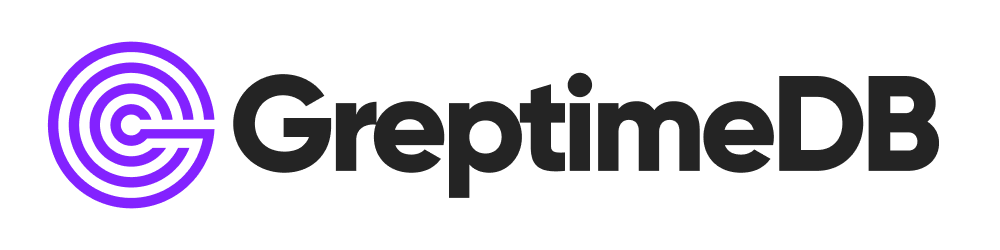

# GreptimeDB Documentation

    

This directory contains sources of all content published at [docs.greptime.com][1]

[1]: https://docs.greptime.com

## Contributing

Thanks a lot for considering contributing to GreptimeDB. People like you would make
GreptimeDB a great product.

Please refer to [contribution guidelines](./CONTRIBUTING.md) for more information.

## Table of Contents

### Introduction

- [Introduction](https://docs.greptime.com/)

### Getting Started

If you are new to Greptime DB, documents below will help you quickly get started

- [Getting started](https://docs.greptime.com/getting-started/try-out-greptimedb)

### User Guide

Explains how to use, integrate or customize GreptimeDB; also includes common issues and solutions

- [Concepts](https://docs.greptime.com/user-guide/concepts/overview)
- [Table Management](https://docs.greptime.com/user-guide/table-management)
- [Ingest Data](https://docs.greptime.com/user-guide/ingest-data/overview)
- [Query Data](https://docs.greptime.com/user-guide/query-data/overview)
- [Manage Data](https://docs.greptime.com/user-guide/manage-data/overview)
- [Integrations](https://docs.greptime.com/user-guide/integrations/overview)
- [Protocols](https://docs.greptime.com/user-guide/protocols/overview)
- [Python Scripts](https://docs.greptime.com/user-guide/python-scripts/overview)
- [Cluster](https://docs.greptime.com/user-guide/cluster)

### Developer Guide

Provides a detailed overview of how GreptimeDB operates and assists you in participating as a contributor in its development

- [Overview](https://docs.greptime.com/contributor-guide/overview)
- [Frontend](https://docs.greptime.com/contributor-guide/frontend/overview)
- [Datanode](https://docs.greptime.com/contributor-guide/datanode/overview)
- [Metasrv](https://docs.greptime.com/contributor-guide/metasrv/overview)

Please refer to [contribution guidelines](CONTRIBUTING.md) for more information.

