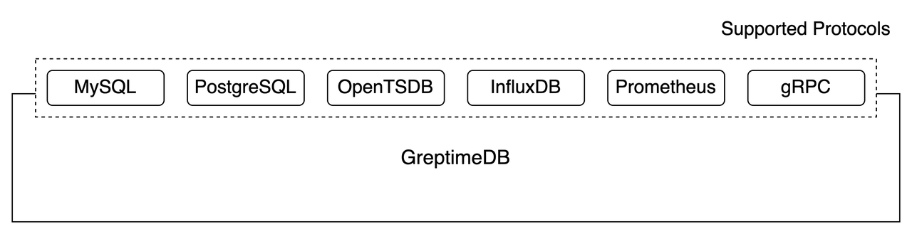

# Reading/Writing Data

::: warning
TODO: Insert references to related documents at all "(x)".
:::

You can read from or write into GreptimeDB using various protocols.



This document will focus on two main protocols, SQL and gRPC, to illustrate
reading and writing in GreptimeDB. Other supported protocols can be found here,
for detailed ways of how to do it.

Note that writing data in a specific protocol does not mean that reading data
has to be with the same protocol. For example, you can write data through
Prometheus endpoint while using MySQL client to read them.

## SQL

GreptimeDB supports executing standard SQL. You can use either MySQL or
PostgreSQL's wire protocol to read from or write into GreptimeDB, through all
kinds of their client tools or connectors. The following guide will use standard
MySQL cli to demonstrate how to do it.

### Connecting to GreptimeDB

Start GreptimeDB (x). GreptimeDB will listen to 127.0.0.1:3306 for MySQL
connections by default, but you can also configure it (x).
Open your favorite terminal, type mysql -h 127.0.0.1 -P 3306, and we are
connected to GreptimeDB.

### Creating Table

First, we need to create a table. Take the example SQL in "Getting Started" guide:

```SQL
mysql> CREATE TABLE system_metrics (
    ->     host STRING,
    ->     idc STRING,
    ->     cpu_util DOUBLE,
    ->     memory_util DOUBLE,
    ->     disk_util DOUBLE,
    ->     ts TIMESTAMP,
    ->     PRIMARY KEY(host, idc),
    ->     TIME INDEX(ts)
    -> );
Query OK, 1 row affected (0.01 sec)
```

A table named `system_metrics` was created. You can use `show tables` to see it:

```SQL
mysql> show tables;
+----------------+
| Tables         |
+----------------+
| numbers        | <- Predefined table for our testing usage.
| scripts        | <- Predefined table for our Python scripts storage.
| system_metrics | <- This is our newly created table!
+----------------+
3 rows in set (0.00 sec)
```

### Inserting Data

Let's insert some testing data. We can just use the `INSERT INTO` SQL
statements:

```SQL
mysql> INSERT INTO system_metrics
    -> VALUES
    ->     ("host1", "idc_a", 11.8, 10.3, 10.3, 1667446797460),
    ->     ("host2", "idc_a", 80.1, 70.3, 90.0, 1667446797461),
    ->     ("host1", "idc_b", 50.0, 66.7, 40.6, 1667446797462);
Query OK, 3 rows affected (0.01 sec)
Then we are good to query it!
```

### Querying Data

Let's use `SELECT` to query data:

```SQL
mysql> select * from system_metrics;
+-------+-------+----------+-------------+-----------+---------------------+
| host  | idc   | cpu_util | memory_util | disk_util | ts                  |
+-------+-------+----------+-------------+-----------+---------------------+
| host1 | idc_a |     11.8 |        10.3 |      10.3 | 2022-11-03 03:39:57 |
| host1 | idc_b |       50 |        66.7 |      40.6 | 2022-11-03 03:39:57 |
| host2 | idc_a |     80.1 |        70.3 |        90 | 2022-11-03 03:39:57 |
+-------+-------+----------+-------------+-----------+---------------------+
3 rows in set (0.01 sec)
```

> Note that currently GreptimeDB does not support MySQL's prepared
> statements. Also, only one database is used, you cannot create database or use
> "use database" to switch them.


## gRPC

GreptimeDB has a custom protocol exposed via gRPC. The following document will
use the gRPC command-line tool
"[grpcurl](https://github.com/fullstorydev/grpcurl)" to illustrate readings and
writings, but you can use any gRPC tools or SDKs to talk to GreptimeDB's gRPC
service.

> You can find our officially supported Java SDK
> [here](https://greptime.feishu.cn/wiki/wikcnRFXMUy1TGUAIDsojtAcsOb).

### Creating Table

GreptimeDB's gRPC service is listening on `127.0.0.1:3001` by default.
Let's create a table called `hello_greptime`:

```shell
~ % grpcurl -plaintext -d '
{
  "header": { "tenant": "0" },
  "admins": [
    {
      "name": "greptime",
      "exprs": [
        {
          "header": { "version": 1 },
          "create": {
            "table_name": "hello_greptime",
            "column_defs": [
              {
                "name": "c1",
                "datatype": 3,
                "is_nullable": false
              },
              {
                "name": "c2",
                "datatype": 12,
                "is_nullable": true
              },
              {
                "name": "ts",
                "datatype": 15,
                "is_nullable": false
              }
            ],
            "time_index": "ts",
            "create_if_not_exists": true
          }
        }
      ]
    }
  ]
}
' 127.0.0.1:3001 greptime.v1.Greptime/Batch
```

Our newly created table has 3 columns. If created successfully, GreptimeDB's
gRPC service will return:

```shell
{
  "admins": [
    {
      "results": [
        {
          "header": {
            "version": 1
          },
          "mutate": {
            "success": 1
          }
        }
      ]
    }
  ],
  "databases": [{}]
}
```

### Inserting Data

Inserts some data:

```shell
~ % grpcurl -plaintext -d '
{
  "header": {
    "tenant": "0"
  },
  "databases": [
    {
      "name": "greptime",
      "exprs": [
        {
          "header": {
            "version": 1
          },
          "insert": {
            "table_name": "hello_greptime",
            "sql": "INSERT INTO hello_greptime VALUES (1, \"a\", 1667446797460)"
          }
        },
        {
          "header": {
            "version": 1
          },
          "insert": {
            "table_name": "hello_greptime",
            "sql": "INSERT INTO hello_greptime VALUES (2, \"b\", 1667446797461)"
          }
        },
        {
          "header": {
            "version": 1
          },
          "insert": {
            "table_name": "hello_greptime",
            "sql": "INSERT INTO hello_greptime VALUES (3, \"c\", 1667446797462)"
          }
        }
      ]
    }
  ]
}
' 127.0.0.1:3001 greptime.v1.Greptime/Batch
```

We are using SQL to insert data here, because it's much clearer for illustrating
purpose. However, we recommend using the following method if you are using SDK:

Assemble the `InsertBatch` message with the data you want to
insert. `InsertBatch` message format is:

```
message InsertBatch {
  repeated Column columns = 1;
  uint32 row_count = 2;
}

message Column {
  string column_name = 1;

  enum SemanticType {
    TAG = 0;
    FIELD = 1;
    TIMESTAMP = 2;
  }
  SemanticType semantic_type = 2;

  message Values {
    repeated int32 i8_values = 1;
    repeated int32 i16_values = 2;
    repeated int32 i32_values = 3;
    repeated int64 i64_values = 4;

    repeated uint32 u8_values = 5;
    repeated uint32 u16_values = 6;
    repeated uint32 u32_values = 7;
    repeated uint64 u64_values = 8;

    repeated float f32_values = 9;
    repeated double f64_values = 10;

    repeated bool bool_values = 11;
    repeated bytes binary_values = 12;
    repeated string string_values = 13;

    repeated int32 date_values = 14;
    repeated int64 datetime_values = 15;
    repeated int64 ts_millis_values = 16;
  }
  // The array of non-null values in this column.
  //
  // For example: suppose there is a column "foo" that contains some int32 values (1, 2, 3, 4, 5, null, 7, 8, 9, null);
  //   column:
  //     column_name: foo
  //     semantic_type: Tag
  //     values: 1, 2, 3, 4, 5, 7, 8, 9
  //     null_masks: 00100000 00000010
  Values values = 3;

  // Mask maps the positions of null values.
  // If a bit in null_mask is 1, it indicates that the column value at that position is null.
  bytes null_mask = 4;

  // Helpful in creating vector from column.
  ColumnDataType datatype = 5;
}

message ColumnDef {
  string name = 1;
  ColumnDataType datatype = 2;
  bool is_nullable = 3;
  optional bytes default_constraint = 4;
}

enum ColumnDataType {
  BOOLEAN = 0;
  INT8 = 1;
  INT16 = 2;
  INT32 = 3;
  INT64 = 4;
  UINT8 = 5;
  UINT16 = 6;
  UINT32 = 7;
  UINT64 = 8;
  FLOAT32 = 9;
  FLOAT64 = 10;
  BINARY = 11;
  STRING = 12;
  DATE = 13;
  DATETIME = 14;
  TIMESTAMP = 15;
}
```

Serialize InsertBatch message to bytes.

Use InsertBatch bytes in InsertExpr.
