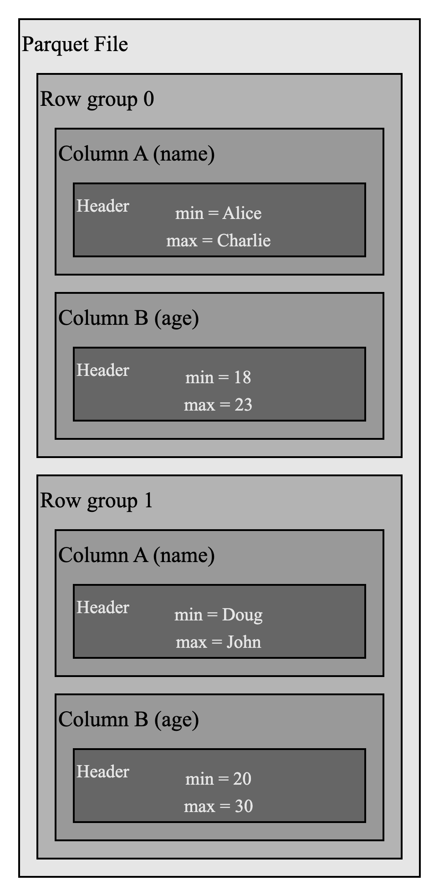

# Data Persistence and Indexing

Similar to all LSMT-like storage engines, data in MemTables is persisted to durable storage like the local disk file system or object storage service. GreptimeDB adopts [Apache Parquet][1] as its persistent file format.

## SST File Format

Parquet is an open source columnar format that provides fast data query and has already been adopted by many projects like Delta Lake.

Parquet has a hierarchy structure like "row groups-columns-data pages". Data in a Parquet file is horizontally partitioned into row groups, in which all values of same column are stored together to form a data page. Data page is the minimal storage unit. Such structure greatly improves performance.

First, clustering data by column makes file scanning more efficient, especially when only a few columns are queried, which is very common in analytical systems.

Second, data of the same column tends to be homogeneous. That can help compression when techniques like dictionary and Run-Length Encoding (RLE) are leveraged.

## Data Persistence

When the size of data buffered in MemTable reaches a threshold, the MemTable will be flushed to a SST file.

## Indexing Data in SST Files

Apache Parquet file format provides inherent statistics in headers of column chunks and data pages, which can be used for pruning and skipping.

For example, in the above Parquet file, if we want to filter row where `name` field is `Emily` we can easily skip row group 0 because the max value for `name` field is `Charlie`. This statistical information can help to reduce IO operations.

Besides Parquet's built-in statistics, we are working on supporting a separate index file that can utilize some time-series specific indexing techniques to improve scan performance.

## Unified Data Access Layer: OpenDAL

GreptimeDB uses [OpenDAL][2] to provide a unified data access layer, thus the storage engine does not need to interact with different storage APIs, thus data can be migrated to cloud-based storage like AWS S3 seamlessly.

[1]: <https://parquet.apache.org>
[2]: <https://github.com/datafuselabs/opendal>
