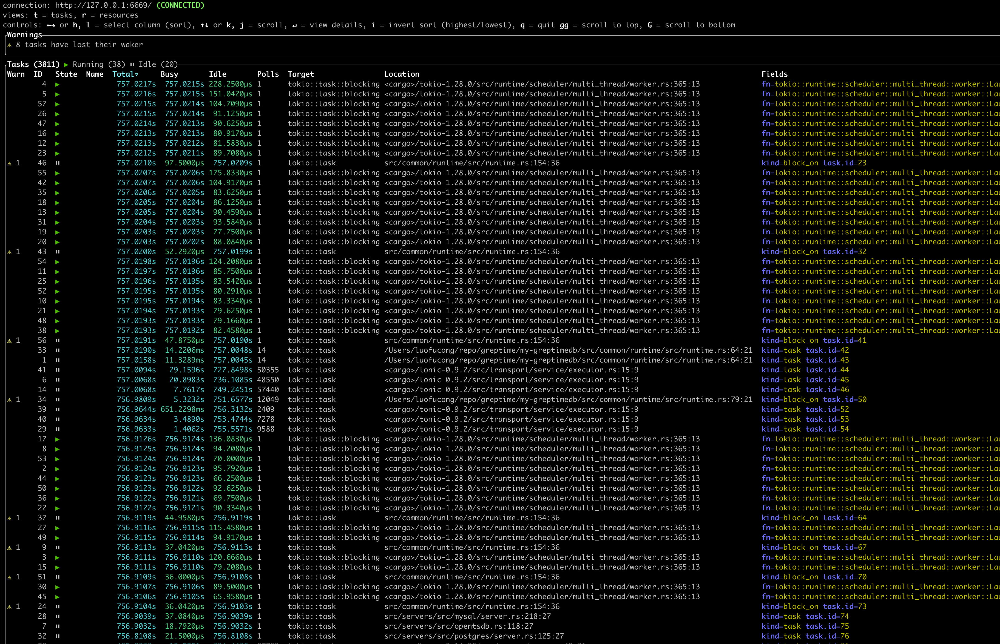

# 2023.05.08 - 2023.05.21 – Tokio Console Enabled for Easier Troubleshooting

May 24, 2023 · 6 min read

## Summary
Together with all our contributors worldwide, we are glad to see GreptimeDB making remarkable progress for the better. Below are some highlights:
- Support `TQL EXPLAIN` / `TQL ANALYZE` clauses
- Enable tokio console
- Support more endpoints for Prometheus HTTP API 

## Contributor list: (in alphabetical order)
For the past two weeks, our community has been super active with a total of **8 PRs** from 6 contributors merged successfully and lots pending to be merged. 
Congrats on becoming our most active contributors in the past 2 weeks:

- [@DiamondMofeng](https://github.com/DiamondMofeng) ([db#1577](https://github.com/GreptimeTeam/greptimedb/pull/1577))
- [@etolbakov](https://github.com/haohuaijin) ([db#1427](https://github.com/GreptimeTeam/greptimedb/pull/1427))
- [@haohuaijin](https://github.com/haohuaijin) ([db#1571](https://github.com/GreptimeTeam/greptimedb/pull/1571) [db#1580](https://github.com/GreptimeTeam/greptimedb/pull/1580))
- [@NiwakaDev](https://github.com/NiwakaDev) ([db#1578](https://github.com/GreptimeTeam/greptimedb/pull/1578))
- [@gitccl](https://github.com/gitccl ) ([db#1527](https://github.com/GreptimeTeam/greptimedb/pull/1527) [docs#348](https://github.com/GreptimeTeam/docs/pull/348/))
- [@Taylor-lagrange](https://github.com/Taylor-lagrange) ([db#1497](https://github.com/GreptimeTeam/greptimedb/pull/1497) [db#1579](https://github.com/GreptimeTeam/greptimedb/pull/1579))

👏 Let's welcome **@gitccl** and **@Taylor-lagrange** as the new contributors to join our community with their **2** PRs merged respectively. 

Special thanks to [@etolbakov](https://github.com/etolbakov), for continuously contributing to our projects, with 14 out of 15 open PRs successfully merged！Thank you for your generous and brilliant contributions! 

A big THANK YOU for all our members and contributors! It is people like you who are making GreptimeDB a great product. Let's build an even greater community together.

## Highlights of Recent PR 
### [Support for `TQL EXPLAIN` and `TQL ANALYZE` clauses](https://github.com/GreptimeTeam/greptimedb/pull/1427)
- `TQL EXPLAIN` (similar to `EXPLAIN` from `SQL`) doesn't execute the query but tells how the query would be executed.
- `TQL ANALYZE` (similar to `ANALYZE` from `SQL`) executes the plan and tells the detailed per-step execution time.

### [Enable Tokio console](https://github.com/GreptimeTeam/greptimedb/pull/1512)
With the integration of `tokio-console` and GreptimeDB, as detailed in the [Greptime Developer Guide](https://docs.greptime.com/developer-guide/how-to/how-to-use-tokio-console), all tokio tasks can now be seamlessly displayed. This enhancement significantly aids in troubleshooting issues related to the tokio runtime.

Tokio console screenshot:



### [Support for additional endpoints in Prometheus HTTP API](https://github.com/GreptimeTeam/greptimedb/issues/1016#issuecomment-1431061736)

In addition to `query` and `query_range` endpoints, as [Prometheus HTTP API](https://prometheus.io/docs/prometheus/latest/querying/api/) describes, there are some other useful endpoints which will help Prometheus users to explore the metadata or details of the datasets. These endpoints will facilitate the seamless integration of GreptimeDB into various systems as a Prometheus service.

Here's an example:

```rust
curl 'localhost:9090/api/v1/labels'
{
    "status": "success",
    "data": [
        "__name__",
        "call",
        "code",
        "config",
        "dialer_name",
        "endpoint",
        "event",
        "goversion",
        "handler",
        "instance",
        "interval",
        "job",
        "le",
        "listener_name",
        "name",
        "quantile",
        "reason",
        "role",
        "scrape_job",
        "slice",
        "version"
    ]
}
```

These are the updates of GreptimeDB and we are constantly making progress. We believe that the strength of our software shines in the strengths of each individual community member. Thanks for all your contributions.

## New things
### GreptimeDB v0.3 is ready for release in early June
We are excited to announce that GreptimeDB v0.3 is ready for release in early June! This forthcoming iteration is an initial distributed version, providing users with an opportunity to test its capabilities firsthand.

This release will spotlight region-level high availability services—an assurance that data reliability will be achieved in subsequent releases. It will also introduce distributed queries for key scenarios, with a particular focus on PromQL query aspects. Moreover, we are committed to delivering a write performance that not only matches but potentially outpaces that of mainstream databases.

### GreptimeDB Community is now open-sourced, welcome to contribute

We extend an invitation to everyone to stay abreast of our updates and await the opportunity to trial GreptimeDB v0.3. Thank you for your support and anticipation!

In order to promote collaboration across teams and create a good culture within the Greptime community, it's important to have documented community guidance so that members can build trust faster and focus on long-term sustainable growth of our community. 

Whether you're a developer, architect, designer, technical writer, or just someone passionate about open-source projects, there's a place for you in our community; Check more details here: https://github.com/GreptimeTeam/Community.

If you have any suggestions for improving this guide, you can either raise PRs or submit a proposal of improvement by sending us an email community@greptime.com. We welcome you to share your ideas and help us build a vibrant and inclusive community!