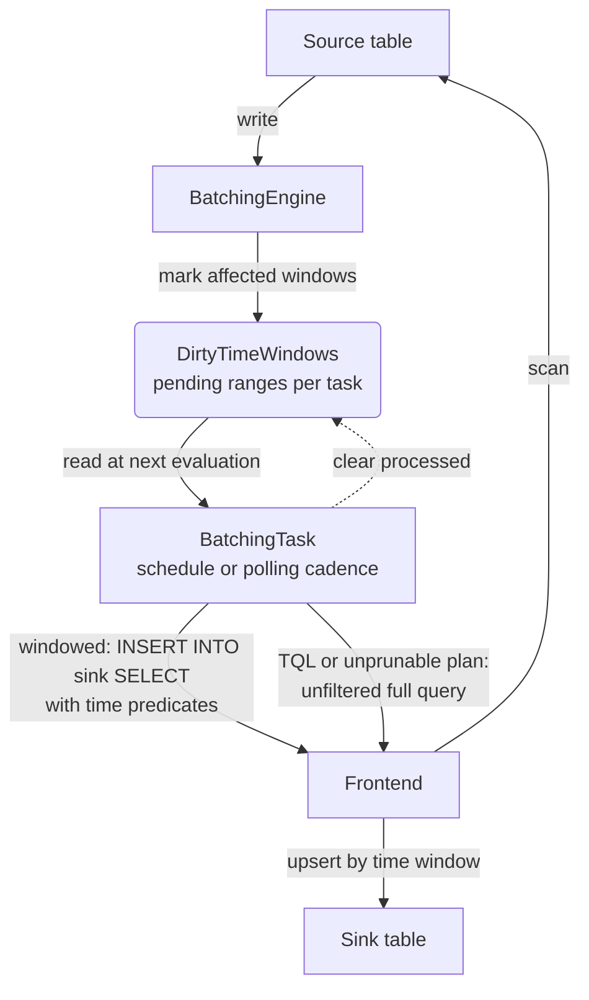

# Batching Mode

This guide provides a brief overview of the batching mode in `flownode`. It's intended for developers who want to understand the internal workings of this mode.

## Overview

The batching mode in `flownode` is designed for continuous data aggregation. It periodically executes a user-defined SQL query over small, discrete time windows. This is in contrast to the legacy streaming path, which processes data as it arrives and is retained for compatibility but deprecated for new workloads.

The core idea is to:
1.  Define a `flow` with a SQL query that aggregates data from a source table into a sink table.
2.  The query typically includes a time window function (e.g., `date_bin`) on a timestamp column.
3.  When new data is inserted into the source table, the system marks the corresponding time windows as "dirty."
4.  A background task runs on its own cadence, consumes the pending dirty windows at its next evaluation, and re-runs the aggregation query for those time ranges.
5.  The results are then inserted into the sink table, effectively updating the aggregated view.

## Architecture

The batching mode consists of several key components that work together to achieve this continuous aggregation. As shown in the diagram below:

### `BatchingEngine`

The `BatchingEngine` is the heart of the batching mode. It's a central component that manages all active flows. Its primary responsibilities are:

-   **Task Management**: It maintains a map of `FlowId` to `BatchingTask`. It handles the creation, deletion, and retrieval of these tasks.
-   **Event Dispatching**: When new data arrives (via `handle_inserts_inner`) or when time windows are explicitly marked as dirty (`handle_mark_dirty_time_window`), the `BatchingEngine` identifies which flows are affected and forwards the information to the corresponding `BatchingTask`s.

### `BatchingTask`

A `BatchingTask` represents a single, independent data flow. Each task is associated with one `flow` definition and runs in its own asynchronous loop.

-   **Configuration (`TaskConfig`)**: This struct holds the immutable configuration for a flow, such as the SQL query, source and sink table names, and time window expression.
-   **State (`TaskState`)**: This contains the dynamic, mutable state of the task, most importantly the `DirtyTimeWindows`.
-   **Execution Loop**: The task runs an infinite loop (`start_executing_loop`) that:
    1.  Checks for a shutdown signal.
    2.  Sleeps until its next evaluation time. A task with an evaluation schedule sleeps until the next scheduled time; an adaptive task sleeps for a polling interval derived from the time window size and the minimum refresh duration.
    3.  Generates a new query plan (`gen_insert_plan`) based on the current set of dirty time windows.
    4.  Executes the query (`execute_logical_plan`) against the database.
    5.  Cleans up the processed dirty windows.

### `TaskState` and `DirtyTimeWindows`

-   **`TaskState`**: This struct tracks the runtime state of a `BatchingTask`, including the `dirty_time_windows` that determine its pending work.
-   **`DirtyTimeWindows`**: This data structure tracks which time windows have received new data since the last query execution. It stores a set of non-overlapping time ranges. The execution loop uses it to build a `WHERE` clause that selects only the dirty windows from the source table.

### `TimeWindowExpr`

The `TimeWindowExpr` is a helper utility for dealing with time window expressions like `date_bin`.

-   **Evaluation**: It can take a timestamp and evaluate the time window expression to determine the start and end of the window that the timestamp falls into.
-   **Window Size**: It can also determine the size (duration) of the time window from the expression.

The same calculation is used to mark dirty windows and generate the source-table filters.

## Query Execution Flow

Here's a simplified step-by-step walkthrough of how a query is executed in batch mode:

1.  **Data Ingestion**: New data is written to a source table.
2.  **Marking Dirty**: The `BatchingEngine` receives a notification about the new data. It uses the `TimeWindowExpr` associated with each relevant flow to determine which time windows are affected by the new data points. These windows are then added to the `DirtyTimeWindows` set in the corresponding `TaskState`. Marking a window dirty does not wake the task.
3.  **Next Evaluation**: The `BatchingTask`'s execution loop reaches its next evaluation, either at a scheduled time or after its adaptive polling interval, and consumes the pending dirty windows.
4.  **Plan Generation**: The task calls `gen_insert_plan`. This method:
    -   Inspects the `DirtyTimeWindows`.
    -   Generates a series of `OR`'d `WHERE` clauses (e.g., `(ts >= 't1' AND ts < 't2') OR (ts >= 't3' AND ts < 't4') ...`) that cover the dirty windows.
    -   Rewrites the original SQL query to include this new filter, ensuring that only the necessary data is processed.
5.  **Execution**: The modified query plan is sent to the `Frontend` for execution. The database processes the aggregation on the filtered data.
6.  **Upsert**: The results are inserted into the sink table. The sink table is typically defined with a primary key that includes the time window column, so new results for an existing window will overwrite (upsert) the old ones.
7.  **State Update**: The `DirtyTimeWindows` set is cleared of the windows that were just processed. The task then goes back to sleep until the next interval.
