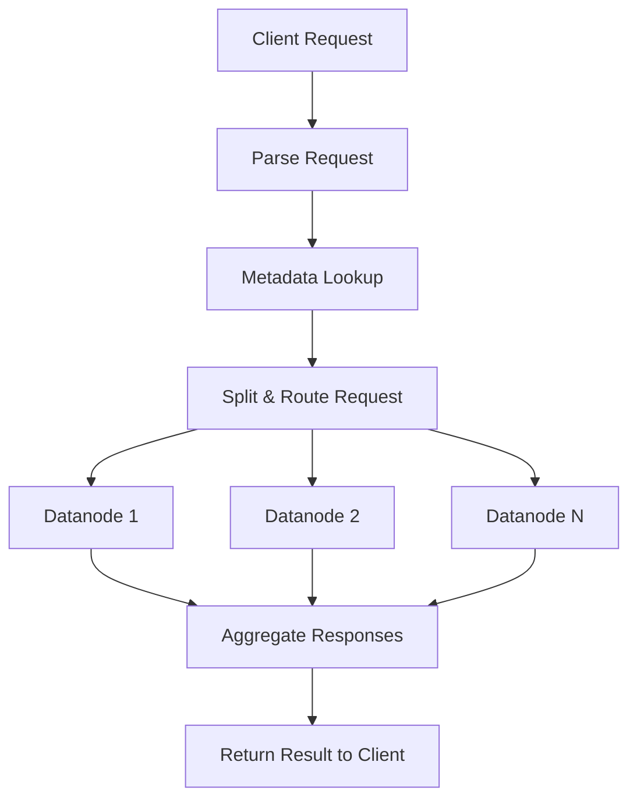

# Frontend

The **Frontend** is a stateless service that serves as the entry point for client requests in GreptimeDB. It provides a unified interface for multiple database protocols and acts as a proxy that forwards read/write requests to appropriate Datanodes in the distributed system.

## Core Functions

- **Protocol Support**: Multiple database protocols including SQL, PromQL, MySQL, and PostgreSQL. See [Protocols][1] for details
- **Request Routing**: Routes requests to appropriate Datanodes based on metadata
- **Query Distribution**: Splits distributed queries across multiple nodes
- **Response Aggregation**: Combines results from multiple Datanodes
- **Tenant Management**: Multi-tenant support and isolation
- **Authorization**: Security and access control validation

## Architecture

### Key Components
- **Protocol Handlers**: Handle different database protocols
- **Catalog Manager**: Caches metadata from Metasrv for efficient request routing
- **Dist Planner**: Converts logical plans to distributed execution plans
- **Request Router**: Determines target Datanodes for each request

### Request Flow

### Deployment

The following picture shows a typical deployment of GreptimeDB in the cloud. The `Frontend` instances
form a cluster to serve the requests from clients:

## Details

- [Table Sharding][2]
- [Distributed Querying][3]

[1]: /user-guide/protocols/overview.md
[2]: ./table-sharding.md
[3]: ./distributed-querying.md
