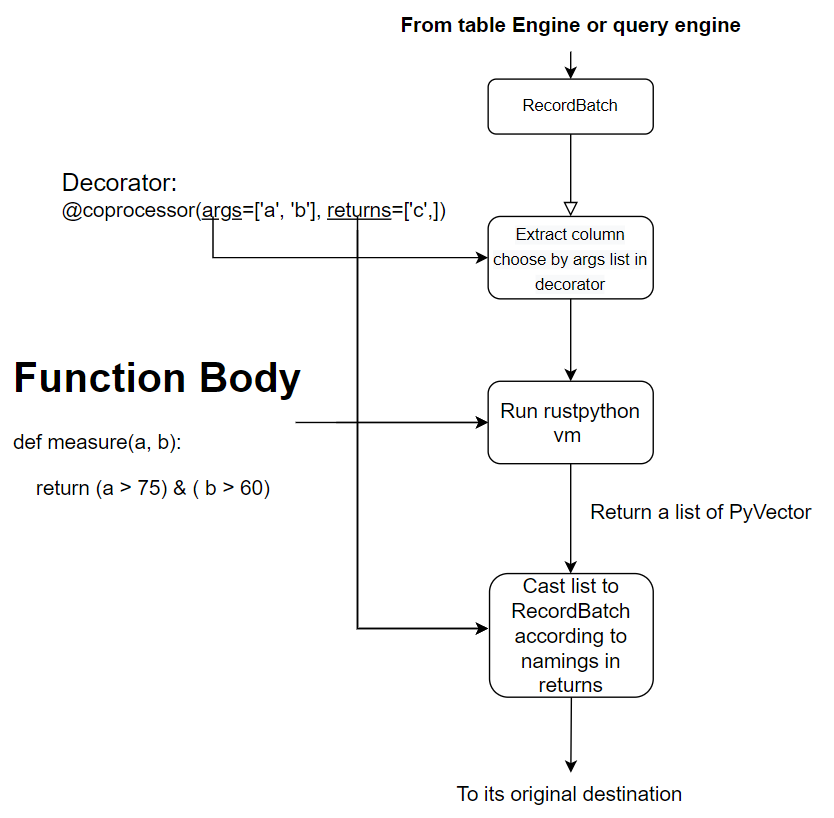

# Python Coprocessor

## Introduction

Coprocessor, as in TiDB and HBase or Stored Procedure in SQL, is a method to analyze data in local
databases and send it to remote node instead of sending all data to remote node, which then lets
remote do the analysis. This way, a lot of data moving costs are saved. This picture below depicts
how coprocessor works . The `RecordBatch` (Basically a column in table with type and nullability
metadata) can come from anywhere in the database, and returned `RecordBatch` can be annotated in
python grammar to indicate its metadata like type or nullability. Coprocessor will try its best to
convert returned object to a `RecordBatch` , be it a python list, a `RecordBatch` computed from
parameters, or a constant(which is extends to the same length of input arguments)

## Two optional backends

### CPython Backend powered by PyO3
This backend is powered by [PyO3](https://pyo3.rs/v0.18.1/), enabling the use of your favourite Python libraries (such as NumPy, Pandas, etc.) and allowing Conda to manage your Python environment.

But using it also involves some complications. You must set up the correct Python shared library, which can be a bit challenging. In general, you just need to install the `python-dev` package. However, if you are using Homebrew to install Python on macOS, you must create a proper soft link to `Library/Frameworks/Python.framework`. Detailed instructions on using PyO3 crate with different Python Version can be found [here](https://pyo3.rs/v0.18.1/building_and_distribution#configuring-the-python-version)

### Embedded RustPython Interpreter

An experimental [python interpreter](https://github.com/RustPython/RustPython) to run
the coprocessor script, it support python 3.10 grammar, but not C API, so no numpy or pandas, but
you can still use all the very pythonic syntax(see [User Guide/Python Coprocessor](/user-guide/python-coprocessor/overview.md) for more!)
