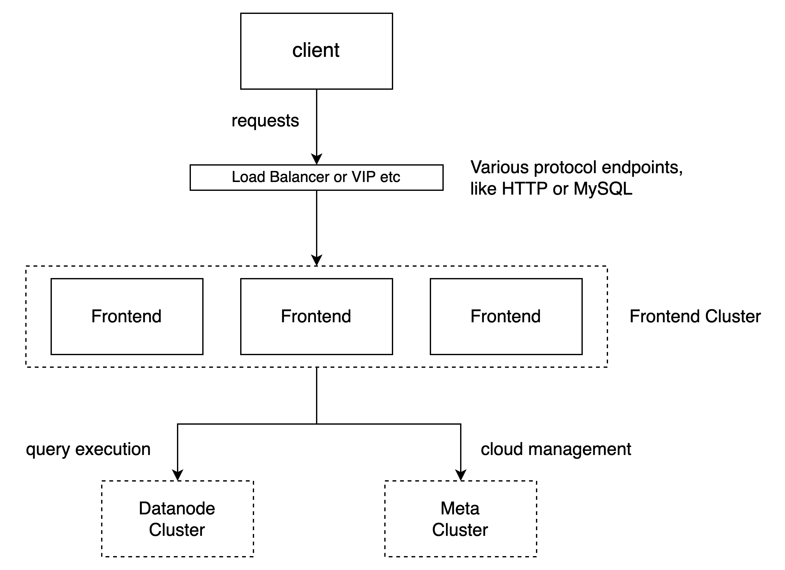

# Overview

## Introduction

The `frontend` is mainly for distributed executing queries and performing certain tasks in the cloud
, like tenant management, authorization validation, flow control, etc.

The `frontend` can expose multiple endpoints for reading and writing data in various protocols. You
can refer to [Clients][1] for more details. After the client's connection is
established, the `frontend` acts as a bridge between the client and Datanodes when interacting with
the data.

Below is a typical deployment flow of GreptimeDB in the cloud. You can see how a client's requests
flow through the `frontend` cluster and how they are processed.

## Details

- [Table Sharding][2]
- [Distributed Querying][3]

[1]: </user-guide/clients/overview.md>
[2]: <./table-sharding.md>
[3]: <./distributed-querying.md>
