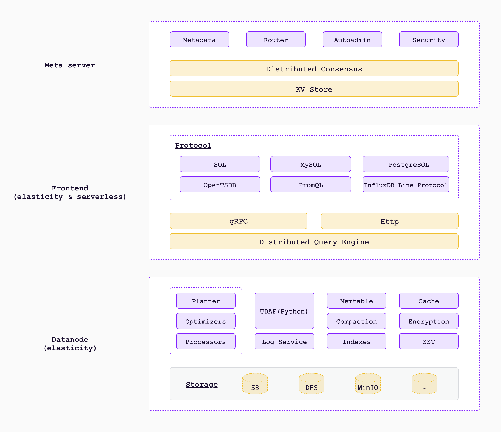
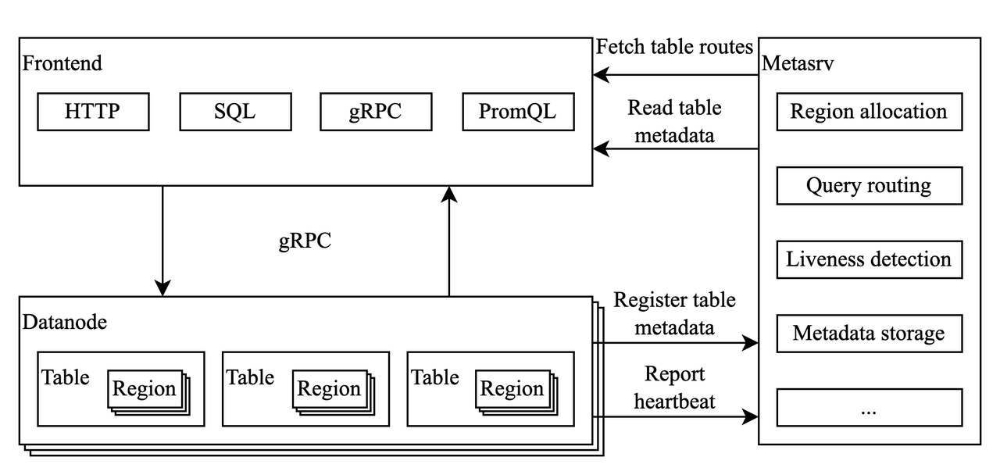

# Overview

## Architecture

`GreptimeDB` consists of the following key components:

- `Frontend` that exposes read and write service in various protocols, forwards requests to
`Datanode`.
- `Datanode` is responsible for storing data to persistent storage such as local disk, S3.
- `Meta` server that coordinates the operations between the `Frontend` and `Datanode`.

## Concepts

To better understand `GreptimeDB`, a few concepts need to be introduced:

- A `table` is where user data is stored in `GreptimeDB`. A `table` has a schema and a totally
ordered primary key. A `table` is split into segments called `region` by its primary key.
- A `region` is a contiguous segment of a table, and also could be regarded as a partition in some
relational databases. A `region` could be replicated on multiple `datanode` and only one of these
replicas is writable and can serve write requests, while any replica can serve read requests.
- A `datanode` stores and serves `region` to frontends. One `datanode` can serve multiple `regions`
and one `region` can be served by multiple `datanodes`.
- The `meta` server stores the metadata of the cluster, such as tables, `datanodes`, `regions` of ach
table, etc. It also coordinates frontends and `datanodes`.
- Each `datanode` or frontend has a remote catalog implementation, which fetches the metadata from
meta, tells which `region` of a `table` is served by which `datanode`.
- A `frontend` is a stateless service that serves requests from client. It acts as a proxy to
forward read and write requests to corresponding `datanode`, according to the mapping from catalog.
- A timeseries of a `table` is identified by its primary key. Each `table` must have a timestamp
column, as `GreptimeDB` is a timeseries database. Data in `table` will be sorted by its primary key
and
timestamp, but the actual order is implementation specific and may change in the future.
- `table` engines are `GreptimeDB` components that handle the SQL operations for different `table`
types.
`Mito` is the default `table engine`. It uses a LSM-Tree based `storage engine` as its storage
backend.

## How it works

Before diving into each component, let's take a high level view of how the database works.

- Users can interact with the database via various protocols, such as ingesting data using
`InfluxDB`'s line protocol, then exploring the data using SQL or PromQL. The `frontend` is the
component users or clients connect to and operate, thus hide`datanode` and `metasrv` behind it.
- Assumes a user uses the HTTP API to insert data into the database, by sending a HTTP request to a
`frontend` instance. When the `frontend` receives the request, it then parses the request body using
corresponding protocol parser, and finds the table to write to from a catalog manager based on
`metasrv`.
- The `frontend` periodically fetches and caches the metadata from `metasrv`, thus it knows which
`datanode`, or more precisely, the region a request should be sent to. A request may be split and
sent to multiple `regions`, if its contents need to be stored in different `regions`.
- When `datanode` receives the request, it writes the data to the table, and then sends response
back to the `frontend`. Writing to the table will then write to the underlying storage engine,
which will eventually put the data to persistent device.
- Once `frontend` has received all responses from the target `datanode`s, it then sends the result
back to the user.

For more details on each component, see the following guides:

- [frontend][1]
- [datanode][2]

[1]: frontend/overview.md
[2]: datanode/overview.md
[3]: meta/overview.md
