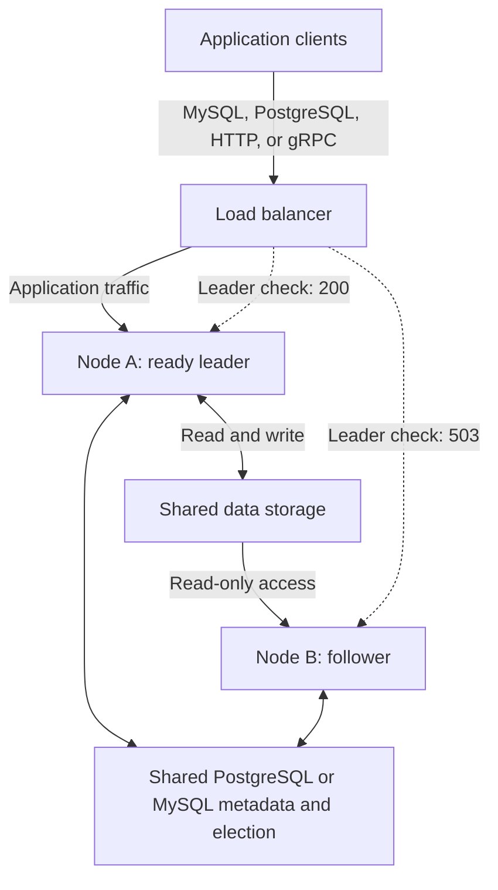

# Standalone Leader-Follower Mode

GreptimeDB Enterprise supports running standalone nodes in leader-follower mode. The nodes share an external metadata store and data storage. One node is elected leader and accepts writes; the other stays running as a follower and can become leader after a failover. You can also enable reads on the follower for workloads that tolerate stale data.

This topology differs from [active-active failover](/enterprise/deployments-administration/disaster-recovery/dr-solution-based-on-active-active-failover.md), where both standalone peers accept writes and replicate changes to each other. It also differs from [cluster Read Replicas](/enterprise/read-replicas/overview.md), which manage follower Regions across Datanodes.

## Choose a Deployment Mode

Use the following comparison to choose between standalone leader-follower mode, [active-active failover](/enterprise/deployments-administration/disaster-recovery/dr-solution-based-on-active-active-failover.md), and a [distributed cluster](/user-guide/concepts/architecture.md).

| Aspect | Standalone leader-follower mode | Active-active failover | Distributed cluster |
| --- | --- | --- | --- |
| Writes and queries | One elected leader accepts writes. Optional follower reads can return stale data. | Both peers accept writes and execute queries locally; changes replicate asynchronously. | Frontends route writes to Region leaders and distribute queries across Datanodes. |
| State and dependencies | Shared PostgreSQL or MySQL metadata and shared data storage; a load balancer routes traffic to the leader. The example below uses a local WAL on each node. | Each peer keeps its own complete data copy and pending replication changes. An external mechanism routes traffic. | Separate Frontend, Metasrv, and Datanode services, plus a metadata backend, data storage, and the selected WAL backend. |
| Failover | Election promotes a follower; the load balancer redirects new connections once the new leader is ready. | An external traffic mechanism switches to an available peer; the topology does not elect a primary. | Configured Region Failover can reopen Regions on surviving Datanodes. Availability depends on WAL, shared storage, and spare capacity. |
| Advantages | Automatic leader promotion with fewer separately deployed GreptimeDB components than a distributed cluster. | Peers can continue serving independently during connectivity interruptions and synchronize after recovery. | Horizontal scaling, distributed query execution, and independent scaling of service components. |
| Limitations | Write capacity remains bounded by one leader. Both nodes depend on shared services, and the local-WAL configuration can lose unflushed writes after a node and its WAL are lost. | Replication lag can leave a peer missing recent writes. Independent writes and Schema changes require reconciliation planning; this is not distributed query scale-out. | More components to deploy and operate. Failover and durability require appropriate configuration rather than following automatically from cluster mode. |

Prefer leader-follower mode when the write workload fits on one standalone node, you want automatic leader promotion without separately deploying cluster components, and you can provide highly available shared metadata and data storage. It suits applications that can reconnect after failover and accept the durability limits of their chosen WAL configuration.

Prefer active-active failover when you need independently writable peers that can continue serving during inter-node connectivity interruptions. Choose a distributed cluster when you need to spread writes or query work across multiple Datanodes. Leader election selects the writable node; the load balancer and clients still handle traffic switching and reconnection.

## System Architecture

Place a load balancer in front of the standalone nodes to provide a stable application endpoint. It must check each node's `/status/standalone/is_leader` HTTP endpoint and route application traffic only to the node returning `200 OK`. A follower or a node preparing leadership returns `503 Service Unavailable` and must not receive traffic through this endpoint.



The diagram shows node A as the current leader. When node B becomes the ready leader, the load balancer must select node B for new connections and stop sending new connections to node A. Configure listeners for the application protocols you use, with the HTTP leader check selecting eligible backends for each listener. Do not use round-robin routing across both nodes based only on process health.

If you enable follower reads, use a separate read-only route for workloads that tolerate stale data. Keep the main application endpoint directed at the ready leader.

## How It Works

When election is enabled, each node starts its services as a follower and participates in leader election through the shared PostgreSQL or MySQL metadata store. The elected node prepares its local Regions and services before accepting writes.

| Role | Behavior |
| --- | --- |
| `follower` | Rejects writes and schema changes. Can refresh local read-only Regions when follower reads are enabled. |
| `leader_preparing` | Has won election but is still preparing to serve traffic. Rejects public writes. |
| `leader` | Is ready to serve reads, writes, and schema changes. |

Roles are assigned by election, so either node can become leader. The load balancer follows these role changes to direct new connections to the ready leader; clients must reconnect when an existing connection still points to a former leader.

## Prerequisites

For a deployment on two separate hosts, prepare:

- A GreptimeDB Enterprise build with standalone leader-follower mode support and the PostgreSQL or MySQL metadata backend you intend to use.
- A load balancer in front of both nodes, configured to route application traffic using the HTTP leader check.
- A shared PostgreSQL or MySQL database for metadata and election. The local `raft_engine` **metadata backend** does not support election.
- Shared data storage, such as an S3 bucket and root prefix, accessible from both nodes. Separate local data directories alone do not provide a shared data copy.
- A unique, reachable gRPC address for each node. Followers use the leader's advertised address to check for data updates when follower reads are enabled.
- Local directories for each node's WAL, logs, and caches, plus the authentication and licensing configuration for your Enterprise deployment.

The shared metadata database and data storage are dependencies of both nodes. Plan their availability along with the standalone nodes.

## Configure the Nodes

The following example configures node A in a new two-host deployment with PostgreSQL metadata and S3 data storage. Replace the addresses, credentials, bucket, and paths for your environment. See [storage options](/user-guide/deployments-administration/configuration.md#storage-options) for other storage settings.

```toml title="standalone.toml"
[http]
addr = "0.0.0.0:4000"

[grpc]
bind_addr = "0.0.0.0:4001"
server_addr = "10.0.0.1:4001"

[wal]
provider = "raft_engine"
dir = "/var/lib/greptimedb/wal"

[storage]
data_home = "/var/lib/greptimedb"
type = "S3"
bucket = "<shared-bucket>"
root = "standalone-ha"
region = "<aws-region>"
access_key_id = "<access-key-id>"
secret_access_key = "<secret-access-key>"

[enterprise_standalone.metadata_store]
backend = "postgres"
store_addrs = ["postgres://<user>:<password>@<metadata-host>:5432/greptime_meta"]
table_name = "greptime_metakv"

[enterprise_standalone.metadata_store.election]
enabled = true
server_addr = "10.0.0.1:4001"
store_key_prefix = "standalone-ha"
meta_election_lock_id = 1
# Optional: refresh read-only Regions while this node is a follower.
enable_follower_read = true
```

On node B, use the same metadata database, metadata table, election prefix, PostgreSQL election lock ID, and S3 bucket/root. Change both `server_addr` values to node B's reachable gRPC address, for example `10.0.0.2:4001`. The local directory paths can be identical on separate hosts, but each node must use its own local WAL directory.

For MySQL metadata, set `backend = "mysql"` and use a MySQL connection URL in `store_addrs`. The election table defaults to `<table_name>_election`; if you set `mysql_election_table_name` in the election section, use the same value on both nodes. `meta_election_lock_id` applies to PostgreSQL.

Start each node with its configuration and your deployment's authentication and licensing options:

```shell
greptime-ee standalone start -c standalone.toml
```

### Election Options

These options belong to `[enterprise_standalone.metadata_store.election]`:

| Option | Default | Purpose |
| --- | --- | --- |
| `enabled` | `false` | Enable leader election. Set to `true` on both nodes. |
| `enable_follower_read` | `false` | Enable periodic follower Region discovery and read refresh. Requires election to be enabled. |
| `server_addr` | Derived from the standalone gRPC advertised address | Identify this participant and advertise the address used for leader RPCs. Use a unique, reachable address for each node. |
| `store_key_prefix` | Empty string | Namespace election records. Use the same prefix within a deployment. |
| `meta_election_lock_id` | `1` | PostgreSQL election lock ID. Use the same ID within a deployment. |
| `candidate_lease_secs` | `600` | Candidate registration lease duration in seconds. Must be greater than zero. |
| `meta_lease_secs` | `5` | Leader lease duration in seconds; also controls follower metadata polling. Must be greater than zero. |
| `mysql_election_table_name` | `<table_name>_election` | MySQL election table name. |

## Follower Reads and Freshness

Follower read refresh is opt-in. With `enable_follower_read = false`, a follower still participates in election, rejects writes, and can be promoted, but it does not periodically discover or catch up Regions for query traffic.

With `enable_follower_read = true`, the follower discovers new, changed, or removed Regions from shared metadata and updates its local read-only Regions. Applications can send queries directly to that follower's SQL or HTTP endpoint. Writes and schema changes must still go to the leader.

Follower queries read data published to shared storage. They do **not** fetch the leader's unflushed memtable data. Read-after-write workloads should query the leader.

Metadata polling uses `meta_lease_secs` (5 seconds by default). Existing Regions are checked for data updates on a separate 30-second catch-up cadence. Visibility also depends on leader flushes, storage access, and refresh completion, so these intervals are not a maximum staleness guarantee. If the leader is unavailable or not ready, the follower retains its current local Regions and retries catch-up later.

For a simple verification, run the following on the leader:

```sql
CREATE TABLE follower_demo (
    ts TIMESTAMP TIME INDEX,
    value DOUBLE
);
INSERT INTO follower_demo VALUES ('2026-01-01 00:00:00', 1.0);
ADMIN FLUSH_TABLE('follower_demo');
```

Then query the follower, allowing time for metadata discovery and data refresh:

```sql
SELECT * FROM follower_demo;
```

The explicit flush publishes data for this check; it does not make follower reads synchronous.

## Check Roles and Route Traffic

Query a node's HTTP endpoint to inspect its role:

```shell
curl http://10.0.0.2:4000/status/standalone/role
```

Example follower response:

```json
{
  "role": "follower",
  "is_leader": false,
  "leader_addr": "10.0.0.1:4001"
}
```

`leader_addr` is the leader's advertised gRPC address, or `null` when the follower does not know it. A node in `leader_preparing` also reports `is_leader: false`.

For load balancer checks that select the write endpoint, use:

```shell
curl -i http://10.0.0.1:4000/status/standalone/is_leader
```

- `200 OK`: the node is the ready leader.
- `503 Service Unavailable`: the node is a follower or is still preparing leadership.

The general `/health` endpoint checks process health; it does not establish that the node can accept writes. Configure write routing to use the leader check. If you enable follower queries, route those separately and allow for stale results.

:::warning Persistent connections after a leader steps down

A persistent MySQL connection or gRPC channel can remain connected to the original leader after it steps down. The connection may still be open, but the node is now a follower and rejects subsequent writes.

Updating the load balancer's backend selection does not migrate established connections to the new leader. Clients and connection pools must handle write rejections, close or replace connections to the former leader, and reconnect through the load balancer after it identifies the new ready leader. Retrying writes on the same connection can continue to fail.

:::

## Failover and Durability

When the leader loses leadership or stops, a follower can win election. It reconciles its local state with shared metadata and prepares its services before reporting `leader` and returning `200` from the leader check. The load balancer then routes new connections to this node. Clients must reconnect through the load balancer; election does not move existing client connections.

Failover time includes election, leader preparation, traffic health checks, and client reconnection. The lease duration alone is not an RTO guarantee.

The example above uses a local WAL on each node. A follower does not replicate the other node's local WAL or unflushed memtables. Writes that exist only in the old leader's local WAL are unavailable to the new leader until recovered and published to shared storage; losing that WAL before publication can lose those writes. This configuration therefore does not guarantee zero RPO. See the [WAL overview](/user-guide/deployments-administration/wal/overview.md) when planning durability requirements.

Before using the deployment for application traffic, verify that only one node passes the leader check, the follower rejects writes, and follower queries work if enabled. Then stop the leader, wait for the other node to pass the leader check, and verify reads and writes through the application's normal endpoint.
