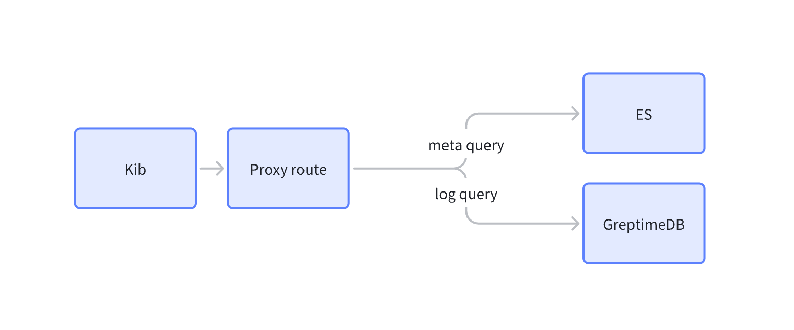

# Overview

The Elasticsearch compatibility layer in GreptimeDB is designed to provide a certain degree of compatibility with Elasticsearch, allowing users to migrate existing Elasticsearch applications to GreptimeDB with relative ease.

However, GreptimeDB does not fully support all features and functionalities of Elasticsearch. In some cases, users may need to adjust or modify their applications to achieve the same functionality in GreptimeDB.

## Principle

Essentially, GreptimeDB receives Elasticsearch QueryDSL syntax, converts it to GreptimeDB's query syntax, and returns data in the Elasticsearch API format to achieve compatibility.

## Supported API List

| API                            | Method | Description          |
| ------------------------------ | ------ | -------------------- |
| /{table_name}/\_search         | POST   | Execute search query |
| /{table_name}/\_async_search   | POST   | Execute search query |
| /\_resolve/index/{schema_name} | POST   | Index document       |
| /{table_name}/\_field_caps     | GET    | Get field info       |

## Supported Query List

| Query        | Description       |
| ------------ | ----------------- |
| match        | Match query       |
| match_phrase | Phrase match      |
| match_all    | Match all         |
| term         | Exact match       |
| prefix       | Prefix match      |
| range        | Range query       |
| exists       | Field existence   |
| bool         | Compound query    |
| aggregation  | Aggregation query |

## Supported Aggregation List

| Aggregation    | Status            | Description    |
| -------------- | ----------------- | -------------- |
| avg            | Not supported yet | Average value  |
| sum            | Not supported yet | Sum            |
| min            | Not supported yet | Minimum value  |
| max            | Not supported yet | Maximum value  |
| count          | ✅                | Count          |
| date_histogram | ✅                | Date histogram |
| histogram      | Not supported yet | Histogram      |
| terms          | Not supported yet | Terms          |

## Querying GreptimeDB with Kibana

As shown in the figure, we use a proxy to distinguish between metadata requests and actual data query requests, enabling queries to GreptimeDB.

For more information,
