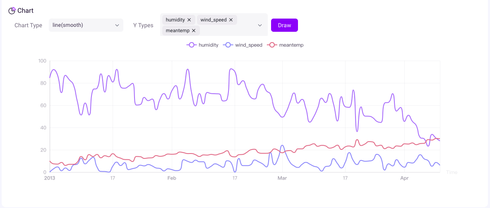
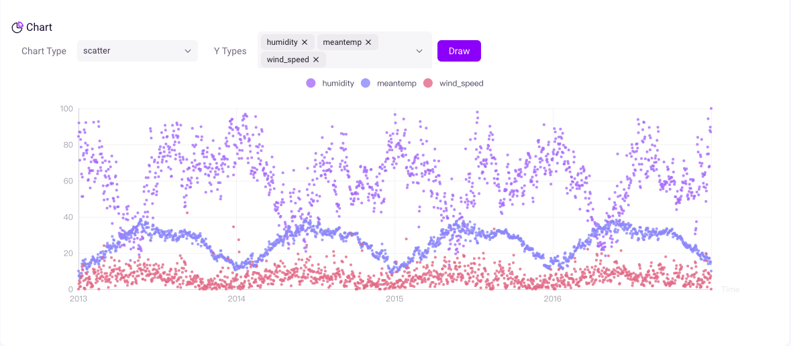

# Getting Started

Begin to explore GreptimeDB's powerful core features.

## Install GreptimeDB
You can try out GreptimeDB with our test builds released on [GitHub](https://github.com/GreptimeTeam/greptimedb/releases) and [Dockerhub](https://hub.docker.com/r/greptime/greptimedb). Note that GreptimeDB is currently under intense development, so these binaries are **not ready to be used in the production environment yet**.

We use the simplest configuration for getting started. For a comprehensive list of configuration options available in GreptimeDB, see the [configuration documentation](/user-guide/operations/configuration.md).

### Linux & Mac

For Linux and macOS users, you can download the latest build of the `greptime` binary by using the following commands:

```shell
curl -L https://raw.githubusercontent.com/GreptimeTeam/greptimedb/develop/scripts/install.sh | sh
```

When the download is complete, the binary file `greptime` will be stored in your current directory. 

You can run the GreptimeDB in standalone mode:

```shell
./greptime standalone start
```

### Docker
Make sure the [Docker](https://www.docker.com/) is already installed. If not, you can follow the official [documents](https://www.docker.com/getting-started/) to install Docker.

```shell
docker run -p 4000-4004:4000-4004 \
-p 4242:4242 -v "$(pwd)/greptimedb:/tmp/greptimedb" \
--name greptime --rm \
greptime/greptimedb standalone start \
--http-addr 0.0.0.0:4000 \
--rpc-addr 0.0.0.0:4001 \
--mysql-addr 0.0.0.0:4002 \
--postgres-addr 0.0.0.0:4003 \
--prom-addr 0.0.0.0:4004 \
--opentsdb-addr 0.0.0.0:4242
```

The data will be stored in the `greptimedb/` directory in your current directory.

If you want to use another version of GreptimeDB's image, you can download it from our [GreptimeDB Dockerhub](https://hub.docker.com/r/greptime/greptimedb).

**Note**:

If you are using a Docker version lower than [v23.0](https://docs.docker.com/engine/release-notes/23.0/), you may experience problems with insufficient permissions when trying to run the command above, due to a [bug](https://github.com/moby/moby/pull/42681) in the older version of Docker Engine.

You can:

1. Set  `--security-opt seccomp=unconfined`, for example:

   ```shell
   docker run --security-opt seccomp=unconfined -p 4000-4004:4000-4004 \
   -p 4242:4242 -v "$(pwd)/greptimedb:/tmp/greptimedb" \
   --name greptime --rm \
   greptime/greptimedb standalone start \
   --http-addr 0.0.0.0:4000 \
   --rpc-addr 0.0.0.0:4001 \
   --mysql-addr 0.0.0.0:4002 \
   --postgres-addr 0.0.0.0:4003 \
   --prom-addr 0.0.0.0:4004 \
   --opentsdb-addr 0.0.0.0:4242
   ```

2. Upgrade the Docker version to v23.0.0 or higher;


## Connect

GreptimeDB supports [multiple protocols](/user-guide/clients.md). We use MySQL client here for simplicity.

```sql
mysql -h 127.0.0.1 -P 4002
```

## Create table

Let's start by creating the `system_metrics` table which contains system resource metrics, including CPU/memory/disk usage. The data is scraped every 5 seconds.

``` sql
CREATE TABLE IF NOT EXISTS system_metrics (
    host STRING,
    idc STRING,
    cpu_util DOUBLE,
    memory_util DOUBLE,
    disk_util DOUBLE,
    ts TIMESTAMP DEFAULT CURRENT_TIMESTAMP,
    PRIMARY KEY(host, idc),
    TIME INDEX(ts)
);
```

Field descriptions:

| Field        | Type      | Description                            |
| :----------- | :-------- | :------------------------------------- |
| host         | string    | The hostname                           |
| idc          | string    | The idc name where the host belongs to |
| cpu\_util    | double    | The percent use of CPU                 |
| memory\_util | double    | The percent use of memory              |
| disk\_util   | double    | The percent use of disks               |
| ts           | timestamp | Timestamp column incrementing          |

* For more information about how to create tables, please refer to [CREATE](/reference/sql/create.md).
* For data types, please check [data types](/reference/data-types.md).

## Insert data

Using the `INSERT` statement is an easy way to add data to your table. Through the following statement, we have inserted three rows into the `system_metrics` table.

``` sql
INSERT INTO system_metrics
VALUES
    ("host1", "idc_a", 11.8, 10.3, 10.3, 1667446797450),
    ("host1", "idc_a", 80.1, 70.3, 90.0, 1667446797550),
    ("host1", "idc_b", 50.0, 66.7, 40.6, 1667446797650),
    ("host1", "idc_b", 51.0, 66.5, 39.6, 1667446797750),
    ("host1", "idc_b", 52.0, 66.9, 70.6, 1667446797850),
    ("host1", "idc_b", 53.0, 63.0, 50.6, 1667446797950),
    ("host1", "idc_b", 78.0, 66.7, 20.6, 1667446798050),
    ("host1", "idc_b", 68.0, 63.9, 50.6, 1667446798150),
    ("host1", "idc_b", 90.0, 39.9, 60.6, 1667446798250);
```

For more information about the `INSERT` statement, please refer to [INSERT](/reference/sql/insert.md).

## Query data

To select all the data from the `system_metrics` table, use the `SELECT` statement:

``` sql
SELECT * FROM system_metrics;
```

The query result looks like the following:

```
+-------+-------+----------+-------------+-----------+---------------------+
| host  | idc   | cpu_util | memory_util | disk_util | ts                  |
+-------+-------+----------+-------------+-----------+---------------------+
| host1 | idc_a |     11.8 |        10.3 |      10.3 | 2022-11-03 03:39:57 |
| host1 | idc_a |     80.1 |        70.3 |        90 | 2022-11-03 03:39:57 |
| host1 | idc_b |       50 |        66.7 |      40.6 | 2022-11-03 03:39:57 |
| host1 | idc_b |       51 |        66.5 |      39.6 | 2022-11-03 03:39:57 |
| host1 | idc_b |       52 |        66.9 |      70.6 | 2022-11-03 03:39:57 |
| host1 | idc_b |       53 |          63 |      50.6 | 2022-11-03 03:39:57 |
| host1 | idc_b |       78 |        66.7 |      20.6 | 2022-11-03 03:39:58 |
| host1 | idc_b |       68 |        63.9 |      50.6 | 2022-11-03 03:39:58 |
| host1 | idc_b |       90 |        39.9 |      60.6 | 2022-11-03 03:39:58 |
+-------+-------+----------+-------------+-----------+---------------------+
9 rows in set (0.00 sec)
```

You can use the `count()` function to get the number of all rows in the table:

``` sql
SELECT count(*) FROM system_metrics;
```

```
+-----------------+
| COUNT(UInt8(1)) |
+-----------------+
|               9 |
+-----------------+
```

The `avg()` function returns the average value of a certain field:

``` sql
SELECT avg(cpu_util) FROM system_metrics;
```

```
+------------------------------+
| AVG(system_metrics.cpu_util) |
+------------------------------+
|            59.32222222222222 |
+------------------------------+
```

You can use the `GROUP BY` clause to group rows that have the same values into summary rows.
The average memory usage grouped by idc:

```sql
SELECT idc, avg(memory_util) FROM system_metrics GROUP BY idc;
```

```
+-------+---------------------------------+
| idc   | AVG(system_metrics.memory_util) |
+-------+---------------------------------+
| idc_a |                            40.3 |
| idc_b |              61.942857142857136 |
+-------+---------------------------------+
2 rows in set (0.03 sec)
```

For more information about the `SELECT` statement, please refer to [SELECT](/reference/sql/select.md).

## Visualize data

Visualization plays a crucial role in effectively utilizing time series data. To help users leverage the various features of GreptimeDB, Greptime offers a simple [dashboard](https://github.com/GreptimeTeam/dashboard).

The Dashboard is embedded into GreptimeDB's binary. After [starting GreptimeDB](#install-greptimedb), the dashboard can be visited via HTTP endpoint `http://localhost:4000/dashboard`. The current version of the dashboard supports MySQL and Python queries, with support for PromQL coming soon.

Write SQL into the command text, then click `Run All`. We'll got all data in system_metrics table.

```
SELECT * FROM system_metrics;
```


We offer various chart types to choose from based on different scenarios. The content of the charts will be richer when you have enough data.






We are committed to the ongoing development and iteration of this open source project, and we plan to expand the application of time series data in monitoring, analysis, and other relevant fields in the future.

## Next steps

Congratulations you have learned the basic features of GreptimeDB. You are ready for the Guides chapter.

* [Concepts](/user-guide/concepts.md)
* [Clients](/user-guide/clients.md)
* [Table management](/user-guide/table-management.md)
* [Write data](/user-guide/write-data.md)
* [Query data](/user-guide/query-data.md)
* [Scripts-&-functions](/user-guide/scripts-&-functions/overview.md)
* [Prometheus](/user-guide/prometheus.md)
* [Operations](/user-guide/operations/overview.md)

