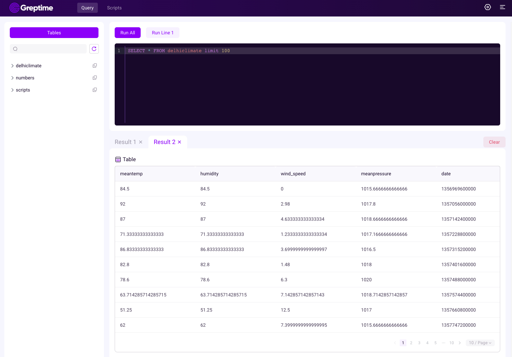

# Visualize data

## Introduction

Visualization plays a crucial role in effectively utilizing time series data.

To help users leverage the various features of GreptimeDB, Greptime offers a simple [dashboard](https://github.com/GreptimeTeam/dashboard).

The current version of the dashboard supports MySQL and Python queries, with support for PromQL coming soon. Please stay tuned for updates.

For different scenarios, we provide different chart types to choose from.

We will continue to develop and iterate this open source project, and will increase the application of time series data in monitoring, analysis and other fields in the future.
