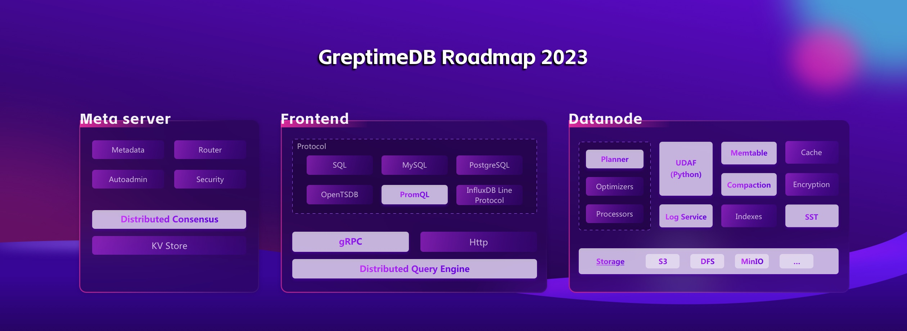

# GreptimeDB Roadmap 2023

GreptimeDB set off in April 2022 and had just open-sourced on Nov. 15th, 2022. Many of our ideas are still on their way, yet to be polished.
As we work towards GreptimeDB 2023, it's natural to ask what's next. This roadmap presents goals our team is working on and concepts we have for our shared community.

- To give people a sense of what to expect in GreptimeDB over the next 6 months;
- for those who would like to contribute to GreptimeDB at [GitHub](https://github.com/greptimeTeam/greptimedb), to help provide "starting points" for how to get involved, and a sense of what kind of projects we are looking for.

## Distributed solution at the production level

From Day 1, Greptime's goal is to **provide an entirely distributed solution with high availability and high reliability**, via the vibrate open source community. We believe that people are truly short of a wholly distributed clusters service, instead of a deficient standalone.

### The plan（Release v0.1）

#### Features

- Incorporate Quorum-based WAL (as an independent subproject) [#626​](https://github.com/GreptimeTeam/greptimedb/issues/626)
  - GreptimeDB's distributed WAL uses a multi-replica mechanism to achieve high data reliability.
- Analyze Query [#608​](https://github.com/GreptimeTeam/greptimedb/issues/608)
  - To optimize queries, we are about to offer observability for execution.
- Design observability system tables [#602​](https://github.com/GreptimeTeam/greptimedb/issues/602)
  - We are going to introduce observability system tables such as metrics, logs, etc., to attain high availability​.
- Enable MySQL/PostgreSQL TLS (suit for new contributors) [#515​](https://github.com/GreptimeTeam/greptimedb/issues/515)
  - It's necessary to have TLS for cloud services.
- Improve fault tolerance using distributed DDL framework
- Integrate test kits

#### Refactor

- Reconstruct gRPC, the data transmission protocol
  - We are planning to refactor on top of Arrow Flight. As the RPC standard of the Arrow ecosystem, Arrow Flight reduces overhead in data transferring and gives neat data formats, which allows better performance.

Join us at [GitHub](https://github.com/greptimeTeam/greptimedb).

## Deeply optimize storage and query engine

Time series data are always high cardinality, which entails fast, accurate, and even automatic data query that goes beyond the capabilities of a traditional database; It's hard to resolve latency issues of multi-component systems.

GreptimeDB is set to support **hybrid time-series and analytical processing (HTiAP)** and permits Python to assist. We allow massive reads and writes at a high frequency, in the meantime, empower complex analytical compute, which helps analyze data in real time.

### The plan（Release v0.1）

#### Features

- Add user-defined window functions
- Escalate compaction L0 up to L1, & involve TTL [#601](https://github.com/GreptimeTeam/greptimedb/issues/601)
  - Compact trivia files, allowing users to clean up data from the old versions and improve query efficiency.
  - Introduce data retention policies.
  - Support data compression.
- Allow multi-region in engine [#625](https://github.com/GreptimeTeam/greptimedb/issues/625)
- Enable object storage, for example, S3
- Continuous aggregating and downsampling [#638](https://github.com/GreptimeTeam/greptimedb/issues/638)
  - It can improve query performance if it is applied to time series with big numbers of samples per each series.

#### Refactor

- Reconstruct datafusion & Arrow
  - We are currently using the branch of datafusion, based on Arrow 2, which is left far behind the main.
  - The mainstream datafusion community is still using the official Arrow version.
- Incorporate time series index
  - Enable data processing according to the time series by better alignment with protocols like Prometheus.

#### Performance

- Optimize memtable
- Improve distributed queries
  - Pushdown UDAF & UDF
- Add SST's filter & index
  - Accelerate queries
- Optimize python coprocessor
  - Improve Robustness and performance

Join us at [GitHub](https://github.com/greptimeTeam/greptimeDB).

## Compatible with open protocols

GreptimeDB embraces open source and goes hand in hand with popular protocols like MySQL, PostgreSQL, OpenTSDB, InfluxDB, Prometheus, etc., so that users can easily integrate with the current ecosystem, saving the troubles of shifting.

### The plan（Release v0.1）

#### Features

- Enable PromQL （suit for new contributors）[#596](https://github.com/GreptimeTeam/greptimedb/issues/596)
  - It's necessary to support PromQL for that is the de-facto standard language of cloud-native observability query.
- Permit PreparedStatement （suit for new contributors）[#470](https://github.com/GreptimeTeam/greptimedb/issues/470)
  - In this way, we can help most of the existing clients that are involved to get started.
- Be capable of Session（suit for new contributors）[#600](https://github.com/GreptimeTeam/greptimedb/issues/600)
  - Considering that some of the protocols rely on it, we are going to strengthen the capability of Session.
- Provide SDK of multi-language（suit for new contributors）[#606](https://github.com/GreptimeTeam/greptimedb/issues/606) [#607](https://github.com/GreptimeTeam/greptimedb/issues/607)
  - We have plans for Rust SDK & Golang SDK

## How you can help

If anything above draws your attention, don't hesitate to join us on [GitHub](https://github.com/greptimeTeam/greptimedb), or Join [GreptimeDB Community on Slack](https://join.slack.com/t/greptimedbcommunity/shared_invite/zt-1jeggrthh-UDISaSqdYUZTtf8wbGxgFg) if you have doubts and would like to talk about it first.

Looking beyond the initiatives that are in progress, there's a lot of room for improvement. Here are some other ideas we'd like to see. For many of these ideas, the main thing they need is someone to own the design! If you might be interested in giving that a try, speak up and chat with the team. We probably will end up being the ones who get you the best.
