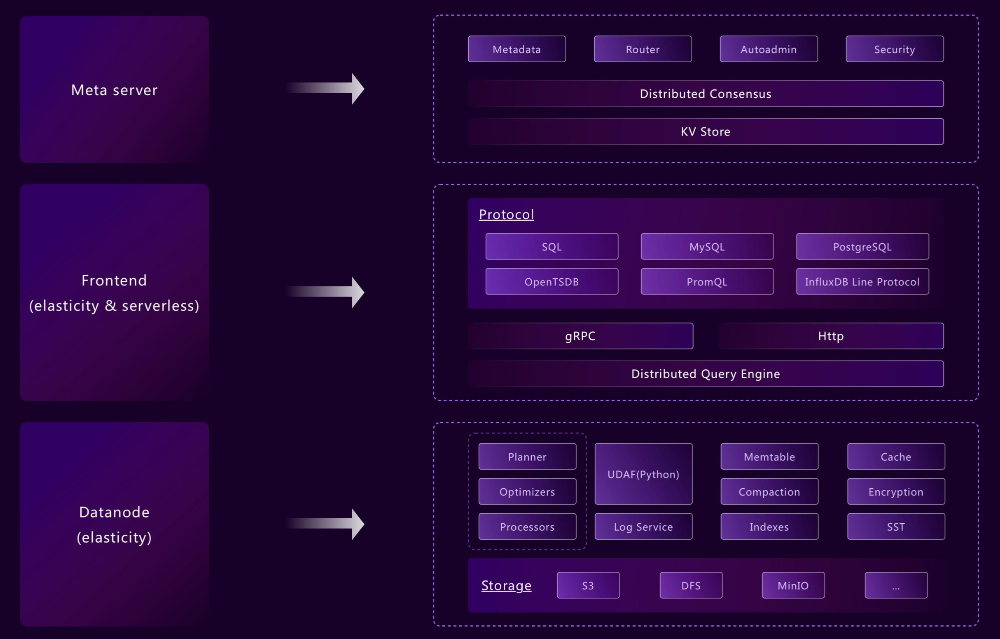

# Concepts

## Components

In order to form a robust database cluster and keep complexity at an acceptable
level, there are three main components in GreptimeDB architecture: Datanode,
Frontend and Meta.

- [**Meta**](../developer-guide/meta/overview.md) is the central command of
  GreptimeDB cluster. In typical deployment, at least three nodes is required to
  setup a reliable *Meta* mini-cluster. *Meta* manages database and table
  information, including how data spread across the cluster and where to route
  requests to. It also keeps monitoring availability and performance of
  *Datanode*s, to ensure its routing table is valid and up-to-date.
- [**Frontend**](../developer-guide/frontend/overview.md) is a stateless
  component that can scale to as many as needed. It accepts incoming request,
  authenticates it, translates it from various protocols into GreptimeDB
  cluster's internal one, and forwards to certain *Datanode*s under guidance
  from *Meta*.
- [**Datanodes**](../developer-guide/datanode/overview.md) hold regions of
  tables and data in Greptime DB cluster. It accepts read and write request sent
  from *Frontend*, and executes it against its data. A single-instance
  *Datanode* deployment can also be used as GreptimeDB standalone mode, for
  local development.

## Objects

To understand how GreptimeDB manages and serves its data, you need to know about
these building blocks of GreptimeDB.

### Database

Similar to *database* in relational databases, database is the minimal unit of
data container, within which data can be managed and computed.

### Table

Table in GreptimeDB is similar to it in traditional relational database except
it requires a timestamp column. The table holds a set of data that shares a
common schema. It can either be created from SQL `CREATE TABLE`, or inferred
from the input data structure (the auto-schema feature). In distributed
deployment, a table can be split into multiple partitions that sit on different
datanodes.

### Table Region

Each partition of distributed table is called a region. A region may contain a
sequence of continuous data, depending on the partition algorithm. Region
information is managed by Meta. It's completely transparent to users who send
the query.

### Data Types

Data in GreptimeDB is strongly typed. Auto-schema feature provides some
flexibility when creating a table. Once the table is created, data of the same
column must share common data type.

Find all the supported data types in [Data Types](../reference/data-types.md).
