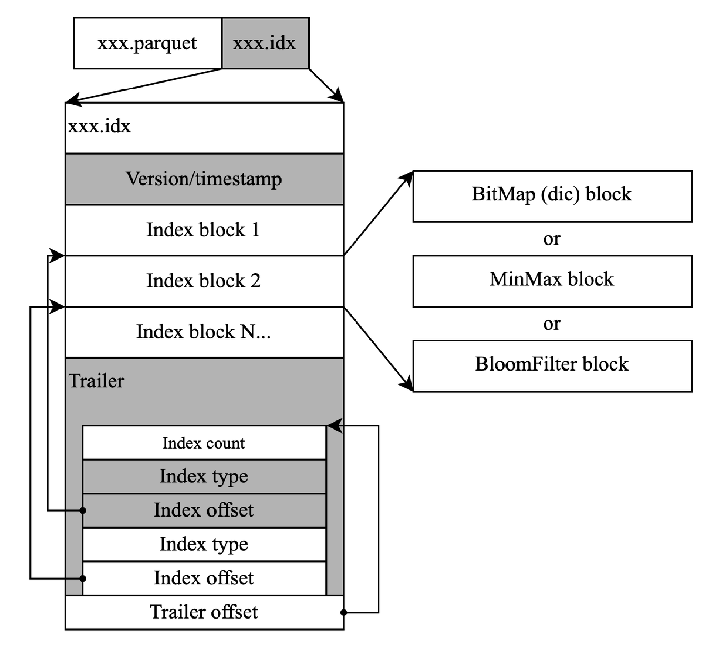
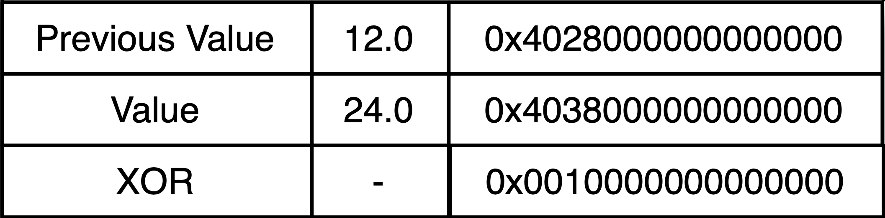

# Concepts

<!-- ## Why GreptimeDB -->

## Data Model

We design our data model mainly based on the table model in relational databases while also considering the characteristics of time-series data.

For example, we have a table `system_metrics` for monitoring the resource usage of a stand-alone device:

```sql
DESC TABLE system_metrics;
```

```sql
+-------------+----------------------+------+---------------------+---------------+
| Field       | Type                 | Null | Default             | Semantic Type |
+-------------+----------------------+------+---------------------+---------------+
| host        | String               | NO   |                     | PRIMARY KEY   |
| idc         | String               | YES  | idc0                | PRIMARY KEY   |
| cpu_util    | Float64              | YES  |                     | FIELD         |
| memory_util | Float64              | YES  |                     | FIELD         |
| disk_util   | Float64              | YES  |                     | FIELD         |
| load        | Float64              | YES  |                     | FIELD         |
| ts          | TimestampMillisecond | NO   | current_timestamp() | TIME INDEX    |
+-------------+----------------------+------+---------------------+---------------+
7 rows in set (0.02 sec)
```


`host` is the hostname of the collected stand-alone machine. The `idc` column shows the data center where the machine is located, `cpu_util`, `memory_util`, `disk_util`, and `load` are the collected stand-alone indicators, and `ts` is the time of collection (Unix timestamp).

Those are very similar to the table model everyone is familiar with. The difference lies in the `TIME INDEX(ts)` constraint, which is used to specify the `ts` column as the time index column of this table.

We call this kind of table TimeSeries Table, which consists of four parts:

- Table name: often the same as indicator name, such as `system_metric` here.
- Time index column: required and normally used to indicate the data generation time in this row. The `ts` column in the example is the time index column.
- Metric Column: data indicators collected, generally change with time, such as the four numerical columns in the example (`cpu_util` and `memory_util`, etc.). The indicators are generally numerical values but may also be other types of data, such as strings, geographic locations, etc. GreptimeDB adopts a multi-value model (a row of data can have multiple metric columns), rather than the single-value model adopted by OpenTSDB and Prometheus.
- Tag Column: labels attached to the collected indicators, such as the `host` and `idc` columns in the example, generally to describe a particular characteristic of these indicators.


GreptimeDB is designed on top of Table for the following reasons:

- The Table model has a broad group of users and it's easy to learn. We just introduced the concept of time index to the time series, which will be used to guide the organization, compression, and expiration management of data.
- Schema is meta-data to describe data characteristics, and it's more convenient for users to manage and maintain. By introducing the concept of schema version, we can better manage data compatibility.
- Schema brings enormous benefits for optimizing storage and computing with its information like types, lengths, etc., on which we could conduct targeted optimizations.
- When we have the Table model, it's natural for us to introduce SQL and use it to process association analysis and aggregation queries between various index tables, offsetting the learning and use costs for users.

Nevertheless, our definition of Schema is not mandatory, but more towards the Schemaless way like MongoDB. See [Automatic Schema Generation](../write-data.md#automatic-schema-generation) for more details.


## Architecture


In order to form a robust database cluster and keep complexity at an acceptable
level, there are three main components in GreptimeDB architecture: Datanode,
Frontend and Meta.

- [**Meta**](../../developer-guide/meta/overview.md) is the central command of
  GreptimeDB cluster. In typical deployment, at least three nodes is required to
  setup a reliable *Meta* mini-cluster. *Meta* manages database and table
  information, including how data spread across the cluster and where to route
  requests to. It also keeps monitoring availability and performance of
  *Datanode*s, to ensure its routing table is valid and up-to-date.
- [**Frontend**](../../developer-guide/frontend/overview.md) is a stateless
  component that can scale to as many as needed. It accepts incoming request,
  authenticates it, translates it from various protocols into GreptimeDB
  cluster's internal one, and forwards to certain *Datanode*s under guidance
  from *Meta*.
- [**Datanodes**](../../developer-guide/datanode/overview.md) hold regions of
  tables and data in Greptime DB cluster. It accepts read and write request sent
  from *Frontend*, and executes it against its data. A single-instance
  *Datanode* deployment can also be used as GreptimeDB standalone mode, for
  local development.

## Storage File Structure

The storage file structure of GreptimeDB includes of the following:

```cmd
├── data
│   ├── greptime
│   ├── procedure
│   └── system
├── logs
│   ├── greptime-standalone-err
│   ├── greptime-standalone
└── wal
    ├── raftlog
    ├── rewrite
    └── LOCK
```

- `data`: The files in data directory store time series data of GreptimeDB. To customize this path, please refer to [Storage option](../operations/configuration.md#storage-option).
- `logs`: The log files contains all the logs of operations in GreptimeDB.
- `wal`: The wal directory contains the write-ahead log files.

## Objects

To understand how GreptimeDB manages and serves its data, you need to know about
these building blocks of GreptimeDB.

### Database

Similar to *database* in relational databases, database is the minimal unit of
data container, within which data can be managed and computed.

### Table

Table in GreptimeDB is similar to it in traditional relational database except
it requires a timestamp column. The table holds a set of data that shares a
common schema. It can either be created from SQL `CREATE TABLE`, or inferred
from the input data structure (the auto-schema feature). In distributed
deployment, a table can be split into multiple partitions that sit on different
datanodes.

### Table Region

Each partition of distributed table is called a region. A region may contain a
sequence of continuous data, depending on the partition algorithm. Region
information is managed by Meta. It's completely transparent to users who send
the query.

### Data Types

Data in GreptimeDB is strongly typed. Auto-schema feature provides some
flexibility when creating a table. Once the table is created, data of the same
column must share common data type.

Find all the supported data types in [Data Types](../../reference/data-types.md).

## Protocols

GreptimeDB supports multiple protocols for data ingestion and query. Please refer to [clients](../clients.md) for more details.

## Smart Indexing

In analytical scenarios of time series, the most common query pattern is to locate the fitting series according to the given tags and time ranges. Traditional time series databases have two ways of fast searching from tags to time series:

- Popular TSDBs, for example, InfluxDB use inverted indexes and will end up spilling memory to disk when the series number increases.
- On the other hand, if we use MPP approach instead, every query request has to go through all the SST files, which brings up the IO overhead. Moreover, the overhead will deteriorate when the SST files are offloaded to object storage on our future cloud version.

GreptimeDB comes up with a mixed solution - build smart indexing and Massively Parallel Processing (MPP) to boost pruning and filtering.

When designing GreptimeDB, the indexing should first boost scan pruning at the storage level. We use independent index files to record statistical information, like what Apache Parquet's row group metadata does. GreptimeDB's indexes permit MinMax, Dictionary, Bloomfilter, etc.



The statistical information will be helpful if and when the query is highly selective. However, if spatial locality does not hold, results scatter around in different blocks, which lowers efficiency. The good thing is that the analytical query pattern in time series always remains stationary. Therefore, we can use built-in metrics to record the workloads of different queries. Combining Cost-Based Optimization(CBO) with user-defined hints, we are able to build a smart index heuristically.


## Data Compression
Real world systems produce a huge volume of timeseries data everyday, so data compression is vital for TSDBs. If we fail to manage and compress those data, users end up costing a lot in storage and maintenance.

GreptimeDB dynamically adopts compression algorithms based on the type and cardinality of data to meet the temporal and spatial complexity constraints.

The most common data types in TSDBs are string and float. GreptimeDB dictionarizes strings when the cardinality of a block exceeds some threshold.

Regarding float point numbers, GreptimeDB adopts Chimp algorithm. Usually, the difference between two adjacent floats is not that significant, so lots of "0"s are produced at the beginning and end of the results after bitwise XOR operation, providing the potential to compress them.

See the example below:


By analyzing real-world time-series datasets, Chimp enhanced Gorilla's (Facebook's in-memory TSDB) algorithm, offering a higher compression rate and spatial efficiency than traditional algorithms such as zstd, Snappy, etc.

## Read More

Get GreptimeDB roadmap and architecture design from blog posts:

* [This Time, for Real - GreptimeDB is Now Open Source](https://greptime.com/blogs/2022-11-15-this-time-for-real)
* [GreptimeDB Internal Design — Distributed, Cloud-native, and Enhanced Analytical Ability for Time Series](https://greptime.com/blogs/2022-12-08-GreptimeDB-internal-design)
* [GreptimeDB Storage Engine Design - Catering to Time Series Scenarios](https://greptime.com/blogs/2022-12-21-storage-engine-design)
