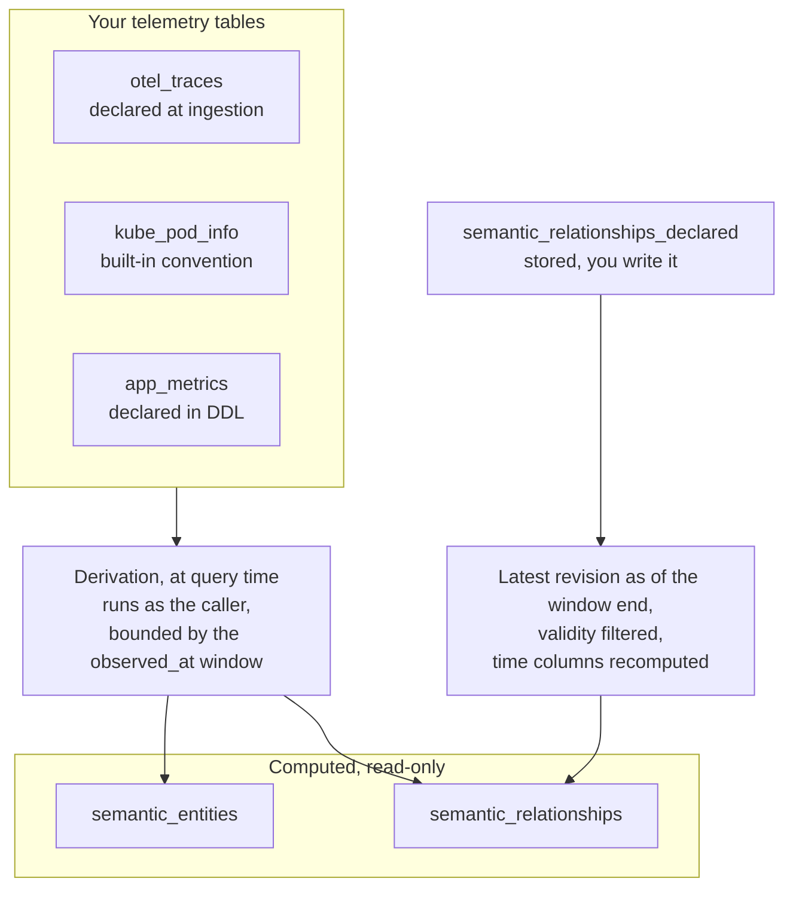

# Semantic Layer

:::warning
The semantic layer is experimental and may change in future releases. Tables without semantic metadata keep working unchanged; the layer is optional and additive.
:::

The semantic layer describes the observability meaning of what GreptimeDB stores, so machine consumers such as LLM agents, alert and dashboard builders, [MCP servers](/user-guide/integrations/mcp.md), and ETL pipelines do not have to infer it from column names. It has two parts:

- **Table semantics** record what a single table represents: the telemetry signal, the ingestion source, and signal-specific metadata such as a metric's unit and instrument type.
- **The semantic graph** records what the telemetry describes: the entities the rows describe (services, hosts, pods, containers, AI agents) and the relationships between them (which service calls which, which pod runs on which node).

The option vocabulary, the graph table schemas, and the queries live in the [Semantic Layer user guide](/user-guide/semantic-layer/overview.md).

## Why it exists

GreptimeDB ingests OTLP metrics, traces, and logs, plus Prometheus remote write, InfluxDB Line Protocol, OpenTSDB, Loki Push API, and Elasticsearch Bulk API data. Two kinds of information arrive with that data and are not written into the resulting rows.

The first is per-table metadata that the ingestion protocol carries and the row encoders drop:

- An OTLP traces table looks like any other wide table; signal type and source must be guessed from naming.
- An OTLP metric's unit (`s`, `By`) is discarded by the row encoders and is unrecoverable from the data.
- OTLP aggregation temporality (`cumulative` vs `delta`) is invisible in the metric name.
- A Prometheus `counter` inferred from a `_total` suffix is not a protocol declaration. Without semantic metadata, the table does not record that distinction.

The second is the structure that spans tables. A service's latency metrics, its spans, and its logs sit in different tables, and the fact that they describe the same service — or that this service calls another one — exists only as a convention over column values. A consumer that wants "this entity, its neighbours, and their telemetry" has to hardcode the topology or guess it.

Keeping both lets an alert generator tell a rate from an absolute value, a dashboard builder pick a visualization by signal type, and an agent walk from an alerting service to its dependencies and on to their telemetry, inside one query engine.

## How it works

Both parts use existing SQL interfaces. Neither adds a protocol or a DDL keyword.

1. **`greptime.semantic.*` table options** store table identity, ingestion metadata, and entity identity alongside options such as `ttl` and `table_data_model`. Supported ingestion paths set them automatically; you can also set them with `CREATE TABLE ... WITH (...)` or `ALTER TABLE ... SET`.
2. **[`information_schema.table_semantics`](/reference/sql/information-schema/table-semantics.md)** is the discovery view for those options and for the entity declarations resolved from them.
3. **`greptime_private.semantic_entities` and `greptime_private.semantic_relationships`** expose the graph as two read-only tables.

## Entities and relationships

An **entity** is a thing the telemetry describes: a service, a service instance, a host, a container, a Kubernetes pod, node, workload, or service, an AI agent, model, or tool. A table declares which entities its rows describe and which columns identify each one. Two tables that name an entity with the same identifying values describe the same entity, so a service reaches the graph from its traces and from its metrics as one node.

A **relationship** is a typed, directed edge between two entities, valid over a time window: `calls`, `runs_on`, `contains`, `part_of`, `depends_on`, `uses`, `invokes`. Every edge carries a `provenance` recording how it was obtained — derived from paired trace spans, derived from two identities appearing on the same row, or declared by hand — and a `confidence`. Call edges also carry RED metrics (request count, error count, duration) for the window they were observed in.

Edges are time-ranged facts rather than current state. A derived edge covers a 60-second window, so "the topology now" is a query over the recent windows, and an entity or edge that stopped producing telemetry stops appearing without an expiry mechanism. A hand-declared edge instead covers the validity period you gave it, and is stored until you retire it or its retention expires.

## Derived at read time

The graph tables are computed, not stored. Scanning them enumerates the entity declarations, builds a query plan per declaring table, and executes it against the telemetry already stored. Only hand-declared edges are persisted, in `greptime_private.semantic_relationships_declared`.

This follows from GreptimeDB storing metrics, logs, and traces in one engine: the service call graph is a self-join over trace tables, and correlating an entity with its telemetry is a join over tables in the same database. Neither needs a second store.

Three consequences follow:

- An entity appears the moment its first row lands. There is no ingestion-time indexing step, no materialization lag, and no second copy of the data to reconcile.
- Derivation runs with the querying user's permissions. A source table the caller cannot read is excluded from the result rather than widening their access.
- Every scan does real work over the source tables, bounded by the queried time window. A query with no `observed_at` predicate at all falls back to the last hour; one whose predicate has no usable lower bound is rejected rather than scanning all history.

## What it changes for an agent

[Agent RCA Bench](https://rca-bench.greptime.com/) measured the semantic layer as its own interface arm, over the same GreptimeDB tables as the plain SQL and PromQL arm.

The clearest effect is on focused evidence retrieval. In the fixed-cohort micro-benchmarks, the semantic interface returned fewer rows in all 35 eligible Discovery results — where the model must first locate the table and signal carrying the evidence — and reduced both rows and tool calls in 11 of 12 dependency-retrieval results.

On service and dependency faults it was also the most accurate of the three interfaces measured: 112 of 120 correct diagnoses with the layer, 106 of 120 on the same tables without it, and 85 of 120 across separate Prometheus, Loki, and Tempo backends. No model was less accurate with the layer on these faults, and four of six were more accurate.

End to end, 14 cases were not enough to separate the two GreptimeDB interfaces. The [report](https://github.com/GreptimeTeam/agent-rca-bench/blob/main/REPORT.md) publishes the measurement protocol and the per-run records.

## Limitations

- RED metrics on `calls` edges describe the span pairs actually observed. Under trace sampling, counts understate real traffic, and error rates are representative only if sampling is unbiased with respect to status and latency.
- The graph is only as connected as the identity values that tables share. Two tables that name the same service with different values produce two nodes. This happens by default when `service.namespace` is set: traces yield the bare service name and Prometheus-style descriptors yield `<namespace>/<name>`.
- `semantic_entities` returns one row per contributing table per window. Consumers deduplicate with `SELECT DISTINCT entity_type, entity_id`.
- Read-time derivation over very large trace tables costs more on every scan than a materialized topology would.

## Next steps

- **[Semantic Layer user guide](/user-guide/semantic-layer/overview.md)** — the options, the graph tables, and the queries.
- [Declaring entities and relationships](/user-guide/semantic-layer/declaring-entities.md) — what reaches the graph without configuration, and how to declare the rest.
- [`information_schema.table_semantics`](/reference/sql/information-schema/table-semantics.md), [`semantic_entities`](/reference/sql/greptime-private/semantic-entities.md), [`semantic_relationships`](/reference/sql/greptime-private/semantic-relationships.md) — column reference.
