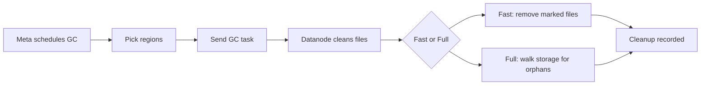

# Overview

GreptimeDB GC delays physical deletion of SST/index files until all references (running queries, [repartition](../manage-data/table-sharding.md#Repartition) cross-region file refs) are released. Turn it on if you need to run repartition or have follower regions serving long-running queries that must keep files available; otherwise you can leave it off.

## How it works

- **Roles**: Meta decides *when/where* to clean; datanodes perform the actual delete while keeping in-use files safe.
- **Safety windows**: `lingering_time` holds known-removed files a bit longer; `unknown_file_lingering_time` is a rare-case guard.
- **Listing modes**: Fast mode removes files the system already marked; full listing walks storage to catch stragglers/orphans.



## Configuration

Meta (`config/metasrv.example.toml`):

```toml
[gc]
enable = false              # Turn on meta GC scheduler; must match datanode.
gc_cooldown_period = "5m"   # Minimum gap before the same region is GCed again.
```

**Meta options**

| Option | Description |
| --- | --- |
| `enable` | Enable the meta GC scheduler. Must match datanode GC enablement. |
| `gc_cooldown_period` | Minimum interval before the same region is scheduled for GC again; keep datanode `lingering_time` longer than this. |

Datanode (`config/datanode.example.toml`):

```toml
[[region_engine]]
[region_engine.mito]
[region_engine.mito.gc]
enable = false                   # Turn on datanode GC worker; must match meta.
lingering_time = "10m"           # Keep known-removed files this long for active queries.
unknown_file_lingering_time = "1h" # Keep files without expel time; rare safeguard.
```

**Datanode options**

| Option | Description |
| --- | --- |
| `enable` | Enable the datanode GC worker. Must match meta GC `enable`. |
| `lingering_time` | How long to keep manifest-removed files before deletion to protect long follower-region queries/cross-region references; set longer than `gc_cooldown_period`. Use `"None"` to delete immediately. |
| `unknown_file_lingering_time` | Safety hold for files without expel time (not tracked in manifest). Should be generous; these cases are rare. |

:::warning
`gc.enable` must be set consistently on metasrv and all datanodes. Mismatched flags cause GC to be skipped or stuck.
:::

## When to enable

- GC only applies when tables use object storage; tables on local filesystems ignore GC settings.
- Turn on GC if need to repartition so cross-region references can drain safely before deletion.
- For clusters with long-running follower-region queries, turn on GC and set `lingering_time` longer than `gc_cooldown_period` so files created or referenced during a GC cycle stay alive (in-use or lingering) until at least the next cycle.
- Leave GC off if you are not repartitioning and do not need delayed deletion.

## Operational notes

- GC is designed for object storage backends (with list/delete support); ensure your store credentials and permissions allow listing and deletion.
- Deleted files live in object storage until GC removes them; ensure storage listing/deletion permissions are in place.
- After enabling, restart metasrv and datanodes to apply config changes.
