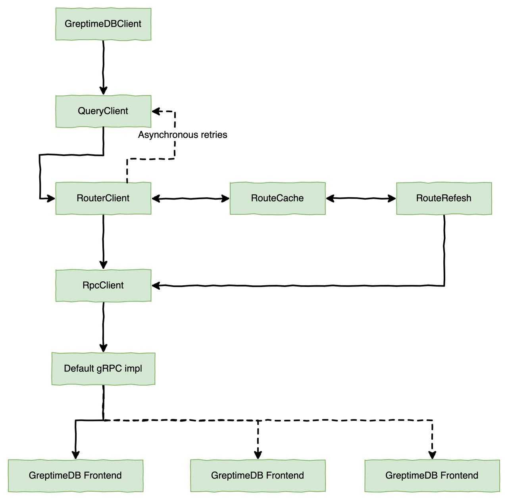

# Java SDK

## Introduction

A Java Client for GreptimeDB, which is compatible with GreptimeDB protocol and lightweight.

## Features

- SPI-based extensible network transport layer; provides the default implementation by using the
gRPC framework
- Non-blocking, purely asynchronous API, easy to use
- Automatically collects various performance metrics by default. Users can then configure them and
write to local files
- Users can take in-memory snapshots of critical objects, configure them, and write to local files.
This is helpful when troubleshooting complex issues

## Data Ingestion Process


GreptimeDB supports automatic create table based on the first writing of data.
Users can also create tables manually. For more details, please refer to [Table Management][1].

``` sql
CREATE TABLE monitor (
    host STRING,
    ts BIGINT,
    cpu DOUBLE DEFAULT 0,
    memory DOUBLE NULL,
    TIME INDEX (ts),
PRIMARY KEY(host)) ENGINE=mito WITH(regions=1);
```

[1]: ./table-management.md

### Write API

``` java
/**
 * Write a single table multi rows data to database.
 *
 * @param rows rows with one table
 * @param ctx  invoke context
 * @return write result
 */
CompletableFuture<Result<WriteOk, Err>> write(WriteRows rows, Context ctx);
```

| Name                 | Description                                                                                |
|:---------------------|:-------------------------------------------------------------------------------------------|
| rows                 | Several rows of data to write to the database (all data must belong to the same table).    |
| ctx                  | The KV in ctx will be written to the gRPC headers metadata then sent to GreptimeDB server. |
| Result<WriteOk, Err> | Inspired by Result in Rust, where WriteOk and Err only one is meaningful and the other is empty.If the call succeeds, you can extract the appropriate information from WriteOk, otherwise you need to extract useful information from Err.                                                                                           |

## How to build WriteRows

``` java
WriteRows rows = WriteRows.newBuilder(TableName.with("db_name", "monitor")) //
    .semanticTypes(SemanticType.Tag, SemanticType.Timestamp, SemanticType.Field, SemanticType.Field) //
    .dataTypes(ColumnDataType.String, ColumnDataType.Int64, ColumnDataType.Float64, ColumnDataType.Float64) //
    .columnNames("host", "ts", "cpu", "memory") //
    .build();
```

## Data Query Process



### Query API

``` java
/**
 * According to the conditions, query data from the DB.
 *
 * @param req the query request
 * @param ctx invoke context
 * @return query result
 */
CompletableFuture<Result<QueryOk, Err>> query(QueryRequest req, Context ctx);
```

### How to build QueryRequest

``` java
QueryRequest request = QueryRequest.newBuilder() //
    .exprType(SelectExprType.Sql) // Currently, only SQL is supported, and more query methods will be supported in the future
    .ql("SELECT * FROM monitor;") //
    .build();
```

## Configuration

### Global Options (System properties / Java -Dxxx)

| Name                                           | Description                                                                                                                                                        |
|:-----------------------------------------------|:-------------------------------------------------------------------------------------------------------------------------------------------------------------------|
| greptimedb.use\_os\_signal                     | Whether or not to use OS Signal, SDK listens for SIGUSR2 signals by default and can outputs some information. This is helpful when troubleshooting complex issues. |
| greptimedb.signal.out\_dir                     | Signal handler can output to the specified directory, default is the process start directory.                                                                      |
| greptimedb.available\_cpus                     | Specify the number of available cpus, the default is to use the full number of cpus of the current environment.                                                    |
| greptimedb.reporter.period\_minutes            | Metrics reporter timed output period, default 30 minutes.                                                                                                          |
| greptimedb.grpc.conn.failures.reset\_threshold | Threshold for gRPC connection reset, default 3                                                                                                                     |
| greptimedb.grpc.pool.core\_workers             | gRPC business thread pool core workers number                                                                                                                      |
| greptimedb.grpc.pool.maximum\_works            | Maximum number of workers in the gRPC business thread pool                                                                                                         |
| greptimedb.read.write.rw_logging               | Whether to print logs for each read/write operation, default off.                                                                                                  |

### GreptimeDBOptions

| Name           | Description                                                                                                                                                                                                                                                                                                                                   |
|:---------------|:----------------------------------------------------------------------------------------------------------------------------------------------------------------------------------------------------------------------------------------------------------------------------------------------------------------------------------------------|
| endpoints      | GreptimeDB server address, can have one or more.                                                                                                                                                                                                                                                                                              |
| asyncWritePool | As a purely asynchronous client, a write scheduling thread pool is required, which can be configured by the user, and will use SerializingExecutor by default. If you configure the pool yourself, please focus on the performance metrics: `async_write_pool.time`, and adjust the configuration of this scheduling thread pool in time. |
| asyncReadPool  | As a purely asynchronous client, a read scheduling thread pool is required, which can be configured by the user, and will use SerializingExecutor by default.If you configure the pool yourself, please focus on the performance metrics: `async_write_pool.time`, and adjust the configuration of this scheduling thread pool in time.   |
| rpcOptions     | Configuration options for RPC component, please refer to `RpcOptions` for details.                                                                                                                                                                                                                                                            |
| routerOptions  | Configuration options for the routing table component, please refer to `RouterOptions` for details.                                                                                                                                                                                                                                           |
| writeOptions   | Configuration options for the write component, please refer to `WriteOptions` for details.                                                                                                                                                                                                                                                    |
| queryOptions   | Configuration options for the query component, please refer to `QueryOptions` for details.                                                                                                                                                                                                                                                                                                                                              |

### RpcOptions

| Name                    | Description                                                                                                                                                                     |
|:------------------------|:--------------------------------------------------------------------------------------------------------------------------------------------------------------------------------|
| defaultRpcTimeout       | Default RPC timeout . Each request can specify timeout individually . If not specified, then this value will be used, The default is 10s.                                       |
| maxInboundMessageSize   | Sets the maximum message size allowed to be received on a channel.                                                                                                              |
| flowControlWindow       | http2.0 based flow control, default 64M                                                                                                                                         |
| idleTimeoutSeconds      | Set the duration(default 5 min) without ongoing RPCs before going to idle mode.In idle mode the channel shuts down all connections.                                         |
| keepAliveTimeSeconds    | Sets the time without read activity before sending a keep-alive ping.                                                                                                           |
| keepAliveTimeoutSeconds | Sets the time waiting for read activity after sending a keep-alive ping.If the time expires without any read activity on the connection, the connection is considered dead. |
| keepAliveWithoutCalls   | Sets whether keep-alive will be performed when there are no outstanding RPC on a connection.                                                                                    |
| limitKind               | Request limiter type, supports Vegas and Gradient, default is Gradient                                                                                                          |
| initialLimit            | Initial limit used by the limiter                                                                                                                                               |
| maxLimit                | Maximum allowable concurrency.  Any estimated concurrency will be capped at this value                                                                                          |
| smoothing               | Smoothing factor to limit how aggressively the estimated limit can shrink when queuing has been detected.                                                                       |
| blockOnLimit            | When set to true, new calls to the channel will block when the limit has been reached instead of failing fast with an UNAVAILABLE status. Default false.                        |

## Limit Policy

GreptimeDBClient provides an adaptive limiter at the gRPC layer based on TCP Vegas and the Gradient
Concurrency-limits algorithm.

### Vegas

Vegas is a congestion control algorithm that actively adjusts the cwnd. The main idea is to set
two thresholds, alpha and beta, and then adjust the cwnd by calculating the difference (diff)
between the target rate (Expected) and the actual rate (Actual), and then comparing the diff
with alpha and beta.

The core algorithm logic is as follows:

``` java
diff = cwnd*(1-baseRTT/RTT)
if (diff < alpha)
    set: cwnd = cwnd + 1
else if (diff >= beta)
    set: cwnd = cwnd - 1
else
    set: cwnd = cwnd
```

### Gradient Concurrency-limits

Concurrent limit algorithm that adjusts the limit based on the gradient
of change in the current average RTT and the long-term exponentially smoothed
average RTT. Unlike traditional congestion control algorithms, the average value
is used instead of the minimum value.

The core algorithm logic is as follows:

``` java
gradient = max(0.5, min(1.0, longtermRtt / currentRtt));

newLimit = gradient * currentLimit + queueSize;

newLimit = currentLimit * (1 - smoothing) + newLimit * smoothing
```

## Metrics&Display

At runtime, users can use the SIGUSR2 signal of the Linux platform to output
the status information (display) of the node and the metrics.

### How

``` shell
kill -s SIGUSR2 pid
```

The relevant information is output to the specified directory.

By default, 2 files are generated in the program's working directory
(cwd: `lsof -p $pid | grep cwd`)

- greptimedb\_client\_metrics.log.xxx: It records all metrics information for the current
client node
- greptimedb\_client\_display.log.xxx: It records important memory state information about the
current client

### List of Metrics (constantly updated)

| Name                                                            | Description                                                                                                                    |
|:----------------------------------------------------------------|:-------------------------------------------------------------------------------------------------------------------------------|
| req\_bytes [counter]                                            | RPC requests total bytes statistics                                                                                            |
| resp\_bytes [counter]                                           | RPC responses total bytes statistics                                                                                           |
| req\_qps\_${rpc\_method} [meter]                                | QPS statistics of RPC requests, separate for each RPC method.                                                                  |
| req\_serialized\_bytes\_${rpc\_method} [histogram]              | Size statistics per RPC request after serialization. The granularity is RPC method.                                            |
| resp\_serialized\_bytes\_${rpc\_method} [histogram]             | Size statistics per RPC response after serialization. The granularity is RPC method.                                           |
| req\_rt\_${rpc\_method} [timer]                                 | Request RT. The granularity is RPC method.                                                                                     |
| req\_rt\_${rpc\_method}\_${address}  [timer]                    | Request RT. The granularity is RPC method + Server address.                                                                    |
| req\_failed\_${rpc\_method} [meter]                             | Request Failure Statistics. The granularity is RPC method.                                                                     |
| req\_failed\_${rpc\_method}\_${address} [meter]                 | Request Failure Statistics. The granularity is RPC method + Server address.                                                    |
| thread\_pool.${thread\_pool\_name} [timer]                      | Thread pool execution task time statistics.                                                                                    |
| scheduled\_thread\_pool.${schedule\_thread\_pool\_name} [timer] | Schedule thread pool execution task time statistics.                                                                           |
| async\_write\_pool.time [timer]                                 | Asynchronous pool time statistics for asynchronous write tasks in SDK, this is important and it is recommended to focus on it. |
| async\_read\_pool.time [timer]                                  | Asynchronous pool time statistics for asynchronous read tasks in SDK, this is important and it is recommended to focus on it.  |
| connection\_counter [counter]                                   | Number of connections established between SDK and server.                                                                      |
| connection\_failure [meter]                                     | Statistics of failed connections between SDK and server.                                                                       |
| write\_rows\_success\_num [histogram]                           | Statistics on the number of successful writes.                                                                                 |
| write\_rows\_failure\_num [histogram]                           | Statistics on the number of data entries that failed to write.                                                                 |
| write\_failure\_num [meter]                                     | Statistics on the number of failed writes.                                                                                     |
| write\_qps [meter]                                              | Write Request QPS                                                                                                              |
| write\_by\_retries\_${n} [meter]                                | QPS for the nth retry write, n == 0 for the first write (non-retry), n > 3 will be counted as n == 3                           |
| read\_rows\_num [histogram]                                     | Statistics of the number of data items per query.                                                                              |
| read\_failure\_num [meter]                                      | Statistics of the number of failed queries.                                                                                    |
| serializing\_executor\_single\_task\_timer\_${name} [timer]     | Serializing executor. Single task execution time consumption statistics                                                        |
| serializing\_executor\_drain\_timer\_${name} [timer]            | Serializing executor. Drains all tasks for time consumption statistics                                                         |
| serializing\_executor\_drain\_num\_${name} [histogram]          | Serializing executor. Statistics on the number of draining tasks                                                               |

## Magic Tools

### How to use `kill -s SIGUSR2 $pid`

The first time you execute `kill -s SIGUSR2 $pid` you will see the following help messages on
the log output, including:

- Turn on/off the output of the condensed version of the read/write log.
- Turn on/off limter
- Export in-memory metrics and memory state information of important objects to a local file

### Just follow the help information

``` text
 - -- GreptimeDBClient Signal Help --
 -     Signal output dir: /Users/xxx/xxx
 -
 -     How to open or close read/write log(The second execution means close):
 -       [1] `cd /Users/xxx/xxx`
 -       [2] `touch rw_logging.sig`
 -       [3] `kill -s SIGUSR2 $pid`
 -       [4] `rm rw_logging.sig`
 -
 -     How to open or close rpc limiter(The second execution means close):
 -       [1] `cd /Users/xxx/xxx`
 -       [2] `touch rpc_limit.sig`
 -       [3] `kill -s SIGUSR2 $pid`
 -       [4] `rm rpc_limit.sig`
 -
 -     How to get metrics and display info:
 -       [1] `cd /Users/xxx/xxx`
 -       [2] `rm *.sig`
 -       [3] `kill -s SIGUSR2 $pid`
 -
 -     The file signals that is currently open:
 -       rpc_limit.sig
 -
```
