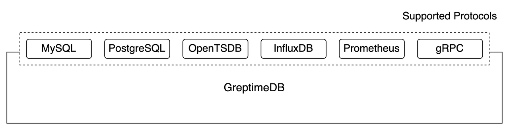

# Reading/Writing Data

You can read from or write into GreptimeDB using various protocols.



This document will focus on two main protocols, SQL and gRPC, to
illustrate reading and writing in GreptimeDB. The list of other
supported protocols can be found here, for detailed ways of how to do it.

Note that writing data in a specific protocol does not mean that you
have to read data with the same protocol. For example, you can write
data through Prometheus endpoint while using MySQL client to read them.

## SQL

GreptimeDB supports executing standard SQL. You can use either MySQL
or PostgreSQL's wire protocol to read from or write into GreptimeDB
through all kinds of client tools or connectors they provide.

The following guide uses standard MySQL clients to demonstrate how to do it.

### Connecting to GreptimeDB

Start GreptimeDB ([Installation](../installation/overview.md)). GreptimeDB will listen to `127.0.0.1:4002` for MySQL connections by default.

Open your favorite terminal, type `mysql -h 127.0.0.1 -P 4002`, and you are
connected to GreptimeDB.

### Creating Table

First, you need to create a table. Take the SQL
in [Getting Started](../getting-started/overview.md) guide as example:

```SQL
CREATE TABLE system_metrics (
     host STRING,
     idc STRING,
     cpu_util DOUBLE,
     memory_util DOUBLE,
     disk_util DOUBLE,
     ts TIMESTAMP,
     PRIMARY KEY(host, idc),
     TIME INDEX(ts)
);
```

```text
Query OK, 1 row affected (0.01 sec)
```

A table named `system_metrics` was created. You can use `show tables` to view it:

```sql
show tables;
```

```text
+----------------+
| Tables         |
+----------------+
| numbers        | <- Predefined table for our testing usage.
| scripts        | <- Predefined table for our Python scripts storage.
| system_metrics | <- This is our newly created table!
+----------------+
3 rows in set (0.00 sec)
```

### Inserting Data with SQL

Let's insert some testing data. You can use the `INSERT INTO` SQL
statements:

```SQL
INSERT INTO system_metrics
 VALUES
     ("host1", "idc_a", 11.8, 10.3, 10.3, 1667446797460),
     ("host2", "idc_a", 80.1, 70.3, 90.0, 1667446797461),
     ("host1", "idc_b", 50.0, 66.7, 40.6, 1667446797462);
```

```text
Query OK, 3 rows affected (0.01 sec)
```

Then we are good to query it!

### Querying Data with SQL

You can use the `SELECT` statement to query data:

```SQL
select * from system_metrics;
```

```text
+-------+-------+----------+-------------+-----------+---------------------+
| host  | idc   | cpu_util | memory_util | disk_util | ts                  |
+-------+-------+----------+-------------+-----------+---------------------+
| host1 | idc_a |     11.8 |        10.3 |      10.3 | 2022-11-03 03:39:57 |
| host1 | idc_b |       50 |        66.7 |      40.6 | 2022-11-03 03:39:57 |
| host2 | idc_a |     80.1 |        70.3 |        90 | 2022-11-03 03:39:57 |
+-------+-------+----------+-------------+-----------+---------------------+
3 rows in set (0.01 sec)
```

> Note that currently GreptimeDB does not support MySQL's prepared
> statements and only one database can be used.
> You cannot create a database or use "use database" to switch between databases.

## gRPC

GreptimeDB has a custom protocol exposed via gRPC. The following document
uses the gRPC command-line tool "[grpcurl](https://github.com/fullstorydev/grpcurl)"
to illustrate readings and writings. You can use any gRPC tools or SDKs to talk
to GreptimeDB's gRPC service.

> You can find Greptime's officially supported Java SDK
> [here](./java-sdk.md).

### Creating Table with gRPC

GreptimeDB's gRPC service is listening on `127.0.0.1:3001` by default.
Let's create a table called `hello_greptime`:

```shell
grpcurl -plaintext -d '
{
  "header": { "tenant": "0" },
  "admins": [
    {
      "name": "greptime",
      "exprs": [
        {
          "header": { "version": 1 },
          "create": {
            "table_name": "hello_greptime",
            "column_defs": [
              {
                "name": "c1",
                "datatype": 3,
                "is_nullable": false
              },
              {
                "name": "c2",
                "datatype": 12,
                "is_nullable": true
              },
              {
                "name": "ts",
                "datatype": 15,
                "is_nullable": false
              }
            ],
            "time_index": "ts",
            "create_if_not_exists": true
          }
        }
      ]
    }
  ]
}
' 127.0.0.1:3001 greptime.v1.Greptime/Batch
```

Our newly created table has 3 columns. If created successfully, GreptimeDB's
gRPC service will return:

```json
{
  "admins": [
    {
      "results": [
        {
          "header": {
            "version": 1
          },
          "mutate": {
            "success": 1
          }
        }
      ]
    }
  ],
  "databases": [{}]
}
```

### Inserting Data with gRPC

Insert data:

```shell
grpcurl -plaintext -d '
{
  "header": {
    "tenant": "0"
  },
  "databases": [
    {
      "name": "greptime",
      "exprs": [
        {
          "header": {
            "version": 1
          },
          "insert": {
            "table_name": "hello_greptime",
            "sql": "INSERT INTO hello_greptime VALUES (1, \"a\", 1667446797460)"
          }
        },
        {
          "header": {
            "version": 1
          },
          "insert": {
            "table_name": "hello_greptime",
            "sql": "INSERT INTO hello_greptime VALUES (2, \"b\", 1667446797461)"
          }
        },
        {
          "header": {
            "version": 1
          },
          "insert": {
            "table_name": "hello_greptime",
            "sql": "INSERT INTO hello_greptime VALUES (3, \"c\", 1667446797462)"
          }
        }
      ]
    }
  ]
}
' 127.0.0.1:3001 greptime.v1.Greptime/Batch
```

You are using SQL to insert data here, because it's much clearer for illustrating
purpose. However, we recommend using the following methods if you are using SDK:

1. Assemble the `InsertBatch` message with the data you want to
insert
1. Serialize `InsertBatch` message to bytes
1. Use `InsertBatch` bytes in `InsertExpr`

The result of the insert request is simple:

```json
{
  "admins": [{}],
  "databases": [
    {
      "results": [
        {
          "header": {
            "version": 1
          },
          "mutate": {
            "success": 1
          }
        },
        {
          "header": {
            "version": 1
          },
          "mutate": {
            "success": 1
          }
        },
        {
          "header": {
            "version": 1
          },
          "mutate": {
            "success": 1
          }
        }
      ]
    }
  ]
}
```

### Querying Data with gRPC

You can wrap the SQL in our gRPC query request like this:

``` shell
grpcurl -plaintext -d '
{
  "header": {
    "tenant": "0"
  },
  "databases": [
    {
      "name": "greptime",
      "exprs": [
        {
          "header": {
            "version": 1
          },
          "select": {
            "sql": "SELECT * FROM hello_greptime"
          }
        }
      ]
    }
  ]
}
' 127.0.0.1:3001 greptime.v1.Greptime/Batch
```

The returned result would be raw bytes of `SelectResult` message:

```json
{
  "admins": [{}],
  "databases": [
    {
      "results": [
        {
          "header": {
            "version": 1
          },
          "select": {
            "rawData": "Cg8KAmMxEAEaBRoDAQIDKAMKEwoCYzIQARoJagFhagFiagFjKAwKHwoCdHMQAhoVggESlOnL3MMwlenL3MMwlunL3MMwKA8QAw=="
          }
        }
      ]
    }
  ]
}
```

You can use the following method to see the decoded query result:

1. `cd` to GreptimeDB's proto files directory
1. Temporarily change the line `import "greptime/v1/column.proto"`
in `select.proto` file to `import "column.proto"`(Because protoc's
"decode" can not find the imported proto files in that way)
1. Submit your gRPC request

```shell
grpcurl -plaintext -d '
{
  "header": {
    "tenant": "0"
  },
  "databases": [
    {
      "name": "greptime",
      "exprs": [
        {
          "header": {
            "version": 1
          },
          "select": {
            "sql": "SELECT * FROM hello_greptime"
          }
        }
      ]
    }
  ]
}
' 127.0.0.1:3001 greptime.v1.Greptime/Batch | jq '.databases[0].results[0].select.rawData' | xargs | base64 --decode | protoc --proto_path=. --decode greptime.v1.codec.SelectResult select.proto
```

The decoded result looks like this:

```text
columns {
  column_name: "c1"
  semantic_type: FIELD
  values {
    i32_values: 1
    i32_values: 2
    i32_values: 3
  }
  datatype: INT32
}
columns {
  column_name: "c2"
  semantic_type: FIELD
  values {
    string_values: "a"
    string_values: "b"
    string_values: "c"
  }
  datatype: STRING
}
columns {
  column_name: "ts"
  semantic_type: TIMESTAMP
  values {
    ts_millis_values: 1667446797460
    ts_millis_values: 1667446797461
    ts_millis_values: 1667446797462
  }
  datatype: TIMESTAMP
}
row_count: 3
```
