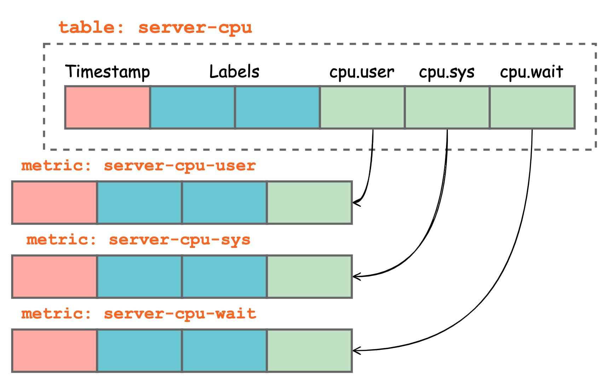

# Use PromQL

## Introduction

There are various ways to invoke PromQL (Prometheus Query Language) in GreptimeDB.

GreptimeDB has reimplemented PromQL natively in Rust and exposes the ability to several interfaces, including the HTTP API of Prometheus, the HTTP API of GreptimeDB, and the SQL interface.

## Via Prometheus' HTTP API

<!-- Maybe add a section to introduce the simulated interfaces, when there is more than one supported -->

Prometheus server has a bunch of HTTP APIs (see their [official document](https://prometheus.io/docs/prometheus/latest/querying/api)), and GreptimeDB has implemented the [`range_query`](https://prometheus.io/docs/prometheus/latest/querying/api/#range-queries) interface, which allows you to query the data in a given time range with PromQL.

We keep the setting of the path and parameter the same as that in Prometheus, so you can use the same client to query GreptimeDB.

## Via GreptimeDB's HTTP API

GreptimeDB also exposes an HTTP API for querying with PromQL. You can find it on `/promql` path under the current stable API version `/v1`, in **GreptimeDB HTTP API Port**. For example:

```shell
curl --location --request GET 'http://localhost:4000/v1/promql?query=sum(some_metric)&start=1676738180&end=1676738780&step=10s'
```

The input parameters are similar to the [`range_query`](https://prometheus.io/docs/prometheus/latest/querying/api/#range-queries) in Prometheus' HTTP API:

- `query=<string>`: Prometheus expression query string
- `start=<rfc3339 | unix_timestamp>`: start timestamp, inclusive
- `end=<rfc3339 | unix_timestamp>`: end timestamp, inclusive
- `step=<duration | float>`: query resolution step width in duration format or float number of seconds

Here are some examples for each type of parameter:
- rfc3339
  - `2015-07-01T20:11:00Z` (default to seconds resolution)
  - `2015-07-01T20:11:00.781Z` (with milliseconds resolution)
  - `2015-07-02T04:11:00+08:00` (with timezone offset)
- unix timestamp
  - `1435781460` (default to seconds resolution)
  - `1435781460.781` (with milliseconds resolution)
- duration
  - `1h` (1 hour)
  - `5d1m` (5 days and 1 minute)
  - `2` (2 seconds)
  - `2s` (also 2 seconds)

The result format is the same as `/sql` interface described [here](supported-protocols/http-api.md#sql).

## Via SQL

GreptimeDB also extends SQL grammar to support PromQL. You can start with the `TQL` (Time-series Query Language) keyword to write parameters and queries. The grammar looks like this:

```sql
TQL [EVAL|EVALUATE] (<START>, <END>, <STEP>) <QUERY>
```

`<START>` specifies the query start range and `<END>` specifies the end time. `<STEP>` identifies the query resolution step width. All of them can either be an unquoted number (represent UNIX timestamp for `<START>` and `<END>`, and duration in seconds for `<STEP>`), or a quoted string (represent an RFC3339 timestamp for `<START>` and `<END>`, and duration in string format for `<STEP>`).

For example:

```sql
TQL EVAL (1676738180, 1676738780, '10s') sum(some_metric)
```

You can write the above command in all places that support SQL, including the GreptimeDB HTTP API, SDK, PostgreSQL and MySQL client etc.

## Data Model

Data in GreptimeDB is organized as tables, which can be thought of as groups of columns. There are three types of columns: Time Index, Primiary Key, and non of both. When mapping to Prometheus, Time Index is the timestamp, Primary Key is the tag (or label) and the rest are values. Hence, GreptimeDB can be thought of as a multi-value data model, one table is a group of multiple Prometheus metrics:



## Limitations

Though GreptimeDB supports a rich set of data types, the PromQL implementation is still limited to the following types:
- timestamp: `Timestamp`
- tag: `String`
- value: `Double`
