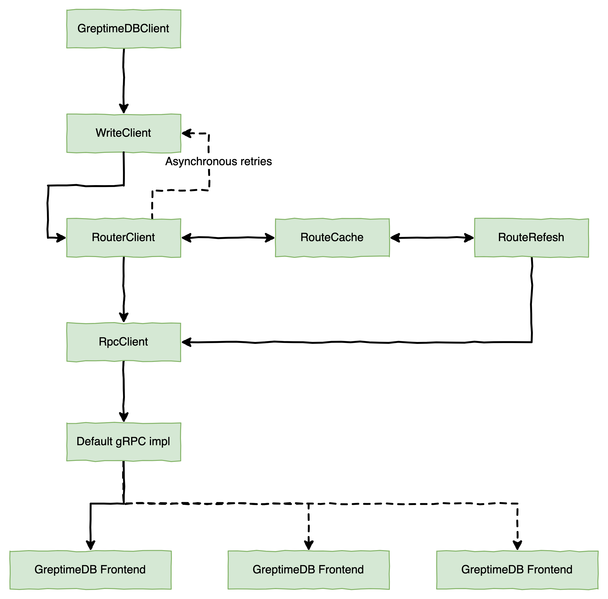

# Write data

Learn how to write data to GreptimeDB. [Connection](./clients.md#connect) is needed before the following operations.

## Insert

### gRPC

#### Java


Use the following code to insert an object to GreptimeDB:

``` java
TableSchema tableSchema = TableSchema.newBuilder(TableName.with("db_name", "monitor"))
    .semanticTypes(SemanticType.Tag, SemanticType.Timestamp, SemanticType.Field, SemanticType.Field)
    .dataTypes(ColumnDataType.String, ColumnDataType.Int64, ColumnDataType.Float64, ColumnDataType.Float64)
    .columnNames("host", "ts", "cpu", "memory")
    .build();

WriteRows rows = WriteRows.newBuilder(tableSchema).build();

rows.insert("127.0.0.1", System.currentTimeMillis(), 0.1, null)
    .insert("127.0.0.2", System.currentTimeMillis(), 0.3, 0.5)
    .finish();

CompletableFuture<Result<WriteOk, Err>> writeFuture = greptimeDB.write(rows);

writeFuture.whenComplete((result, throwable) -> {
    if (throwable != null) {
        throwable.printStackTrace();
    } else {
        System.out.println(result);
    }
});
```

To begin, we must create a `TableSchema` and then use it to construct a `WriteRows` object. Since the `TableSchema` can be reused, caching it can prevent unnecessary construction.

Once the `WriteRows` object is created, data can be added to it. However, this data is only stored in memory and has not yet been sent to the server. To insert multiple rows efficiently, we use batch insertion. Once all desired data has been added to the `WriteRows`, remember to call its `finish` method before sending it to the server.

After calling the `write` method on our completed `WriteRows`, a future will be returned which allows us to obtain write results through its callback function.

##### Write API

``` java
/**
 * Write a single table multi rows data to database.
 *
 * @param rows rows with one table
 * @param ctx  invoke context
 * @return write result
 */
CompletableFuture<Result<WriteOk, Err>> write(WriteRows rows, Context ctx);
```

| Name                 | Description                                                                                |
|:---------------------|:-------------------------------------------------------------------------------------------|
| rows                 | Several rows of data to write to the database (all data must belong to the same table).    |
| ctx                  | The KV in ctx will be written to the gRPC headers metadata then sent to GreptimeDB server. |
| Result<WriteOk, Err> | Inspired by Result in Rust, where WriteOk and Err only one is meaningful and the other is empty.If the call succeeds, you can extract the appropriate information from WriteOk, otherwise you need to extract useful information from Err.                                                                                           |

<!-- ### Go
TODO -->

### SQL

#### `INSERT` statement

Let's insert some testing data to the system_metrics table which we created before. You can use the INSERT INTO SQL statements:

``` sql
INSERT INTO system_metrics
VALUES
    ("host1", "idc_a", 11.8, 10.3, 10.3, 1667446797450),
    ("host2", "idc_a", 80.1, 70.3, 90.0, 1667446797450),
    ("host1", "idc_b", 50.0, 66.7, 40.6, 1667446797450);
```
```sql
Query OK, 3 rows affected (0.01 sec)
```

Through the above statement, we have inserted three rows into the `system_metrics` table.

For more information about the `INSERT` statement, please refer to the SQL reference document.


#### HTTP API

Use GET method to insert data:

```shell
curl  -v -XGET -G http://localhost:4000/v1/sql  --data-urlencode "sql=INSERT INTO system_metrics(idc, cpu_util, memory_util, disk_util) VALUES(\"idc_a\", 19.6, 20, 2), (\"idc_b\", 25.8, 34, 12), (\"idc_b\", 25.8, 45, 1)"
```

use POST method to insert data:

```shell
curl http://localhost:4000/v1/sql -d "sql=INSERT INTO system_metrics(idc, cpu_util, memory_util, disk_util) VALUES('idc_a', 19.6, 20, 2), ('idc_b', 25.8, 34, 12), ('idc_b', 25.8, 45, 1)"
```

The result is shown below:

```json
{"code":0,"output":[{"affectedrows":2}],"execution_time_ms":6}
```


### InfluxDB Line Protocol

GreptimeDB supports HTTP InfluxDB line protocol. You can write data via /influxdb/write API:

```shell
curl -i -XPOST "http://localhost:4000/v1/influxdb/write?db=public&precision=ms" \
--data-binary \
'system_metrics,host=host1,idc=idc_a cpu_util=11.8,memory_util=10.3,disk_util=10.3 1667446797450
 system_metrics,host=host2,idc=idc_a cpu_util=80.1,memory_util=70.3,disk_util=90.0 1667446797450
 system_metrics,host=host1,idc=idc_b cpu_util=50.0,memory_util=66.7,disk_util=40.6 1667446797450'
```

The `/influxdb/write` supports query params including:

* `db` specify which db to write, `public` by default.
* `precision`, precision of timestamps in the line protocol. Accepts `ns` (nanoseconds), `us`(microseconds), `ms` (milliseconds) and `s` (seconds), nanoseconds by default.


### OpenTSDB Line Protocol

GreptimeDB supports ingesting OpenTSDB lines via Telnet or HTTP API.

#### Telnet

GreptimeDB fully supports Opentsdb's "put" command format:

`put <metric> <timestamp> <value> <tagk1=tagv1[tagk2=tagv2...tagkN=tagvN]>`

You can use `put`  to insert metrics:

```shell
~ % telnet 127.0.0.1 4242
Trying 127.0.0.1...
Connected to localhost.
Escape character is '^]'.
put sys.cpu.system 1667892080 3 host=web01 dc=hz
put sys.cpu.system 1667892080 2 host=web02 dc=hz
put sys.cpu.system 1667892080 2 host=web03 dc=hz
put sys.cpu.system 1667892081 1 host=web01
put sys.cpu.system 1667892081 4 host=web04 dc=sh
put sys.cpu.system 1667892082 10 host=web10 dc=sh
quit
Connection closed by foreign host.
~ %
```

GreptimeDB treats each metric as an individual table, and makes tags its columns.
`greptime_timestamp` and `greptime_value` are two reserved columns, corresponding to timestamp and
value in put command.

GreptimeDB will automatically creates the metrics table after you put the metrics so you don't need
to create the metrics table manually.

> Note that only "put" command is supported, other commands such as "histogram" or "stats"
> are not supported.

#### HTTP API

GreptimeDB also supports inserting OpenTSDB metrics via HTTP endpoints. We use the request and
response format described in OpenTSDB's `/api/put`.

The HTTP endpoint in GreptimeDB for handling metrics is `/opentsdb/api/put`

> Note: remember to prefix the path with GreptimeDB's http API version, `v1`.

Starting GreptimeDB, the HTTP server is listening on port `4000` by default.

Use curl to insert one metric point:

```shell
curl -X POST http://127.0.0.1:4000/v1/opentsdb/api/put -d '
{
    "metric": "sys.cpu.nice",
    "timestamp": 1667898896,
    "value": 18,
    "tags": {
       "host": "web01",
       "dc": "hz"
    }
}
'
```

Or insert multiple metric points:

```shell
curl -X POST http://127.0.0.1:4000/v1/opentsdb/api/put -d '
[
    {
        "metric": "sys.cpu.nice",
        "timestamp": 1667898896,
        "value": 1,
        "tags": {
           "host": "web02",
           "dc": "hz"
        }
    },
    {
        "metric": "sys.cpu.nice",
        "timestamp": 1667898897,
        "value": 9,
        "tags": {
           "host": "web03",
           "dc": "sh"
        }
    }
]
'
```

### PromQL

See [Prometheus Query Language](./prometheus.md#prometheus-query-language) to know how to write data.

## Delete

### SQL

#### `Delete` Statement

To delete a row from it by primary key `host` and timestamp index `ts`:
```sql
DELETE FROM system_metrics WHERE idc = 'idc_a' and ts = 1667446797450;
```

```
Query OK, 1 row affected (0.00 sec)
```

For more information about the `Delete` statement, please refer to the [SQL DELETE](/reference/sql/delete.md).

#### HTTP API

Use GET method to delete data:

```shell
curl  -v -XGET -G http://localhost:4000/v1/sql  --data-urlencode "sql=DELETE FROM system_metrics WHERE idc = 'idc_a' and ts = 1667446797450"
```

use POST method to delete data:

```shell
curl http://localhost:4000/v1/sql -d "sql=DELETE FROM system_metrics WHERE idc = 'idc_a' and ts = 1667446797450"
```

The result is shown below:

```json
{"code":0,"output":[{"affectedrows":1}],"execution_time_ms":1}
```

