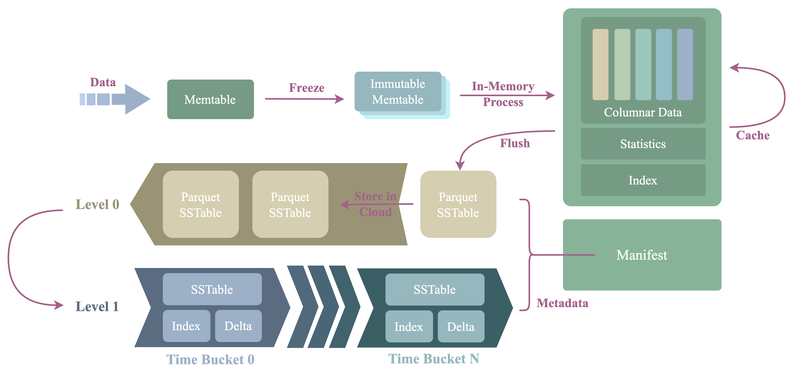

# Storage Engine

## Introduction

`Storage Engine` manages how data is stored in our product. The Mito table engine uses the storage
engine to implement its table model. This engine is based on [LSMT][1] (Log-structured Merge-tree),
but is optimized by our team of engineers to process time-series workload, thus is not designed for
a general-purpose use case.

## Architecture

The picture below shows the architecture and process procedure of the storage engine.



The architecture is the same as a traditional LSMT engine:

- [WAL][2]
  - Guarantees high durability for data that is not yet being flushed.
  - Implemented based on the `Log Store` API, thus it doesn't care about the underlying storage
    media.
  - Log records of the WAL can be stored in the local disk, or a distributed log service which
    implements the `Log Store` API.
- Memtables:
  - Data is written into the `active memtable`, aka `mutable memtable` first.
  - When a `mutable memtable` is full, it will be changed to a `read-only memtable`, aka `immutable memtable`.
- SST
  - The full name of SST, aka SSTable is `Sorted String Table`.
  - `Immutable memtable` is flushed to persistent storage and produces an SST file.
  - The data is partitioned into `SST` in different `Time bucket` by their timestamp.
- Compactor
  - Small `SST` is merged into large `SST` by the compactor via compaction.
- Manifest
  - The manifest stores the metadata of the engine, such as the metadata of the `SST`.
- Cache
  - Speed up queries.

[1]: https://en.wikipedia.org/wiki/Log-structured_merge-tree
[2]: https://en.wikipedia.org/wiki/Write-ahead_logging

## Data Model

The storage engine provides a data model between a key-value model and a table model. It provides a
multi-column, key-value model in which, each row consists of multiple key columns and value columns:

```text
colk-1, ..., colk-m, timestamp, version -> colv-1, ..., colv-n
```

Each row of the mapping has the following forms:

- `0 ~ m` `key columns`
  - `key columns` are nullable
- MUST have a `timestamp column`
  - `timestamp column` is not nullable
- an optional `version column`
- Has `0 ~ n` `value columns`
  - `value columns` are nullable
- `key columns`, `timestamp` and `version` form the `row key`
  - `row key` locates a row
  - Rows can have duplicate row keys in the future, in order to store data without unique keys.
  - `timestamp` and `version` are special key columns that have reserved column names, thus we
    sometimes call them `key columns` when we don't need to distinguish them from other key columns.

### Region

Data in the storage engine is stored in a region, a logically isolated storage unit in the engine.
Rows in a `region` must have the same `schema`, which defines the key and the value columns in this
region.

`region` is similar to `table` in a database, in the way that they both have `schema`, and the data
within them are isolated logically. In fact, Mito table engine divides a table into one or multiple
regions.

### Column Family

Columns in a region are organized into column families:

- Each column belongs to a `column family`, or `cf` in short
- `column families` may be stored separately.
- Unlike some storage systems, in GreptimeDB, columns in the same region must have unique column
  names, even though they belong to different column families
  - This is because we directly map the column name of the region to which of the table
- Each region has a `default` `column family`
- Since the `column family` feature isn't fully ready in the current released version yet, all
  columns are stored in the "default" `column family`. In the future, you will be able to store
  columns under different `column family`
