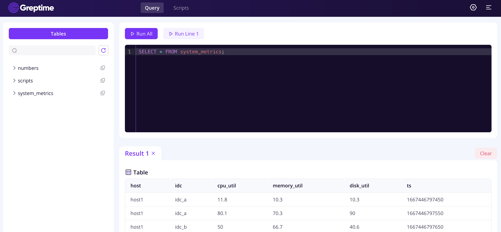
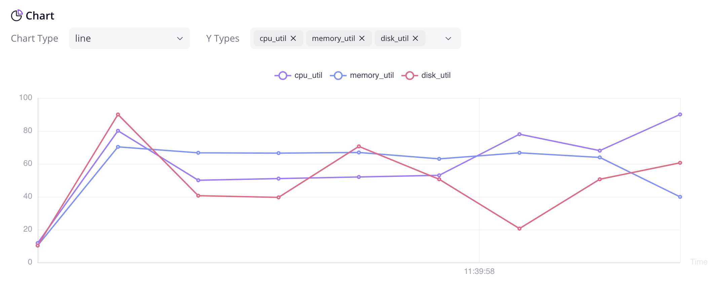
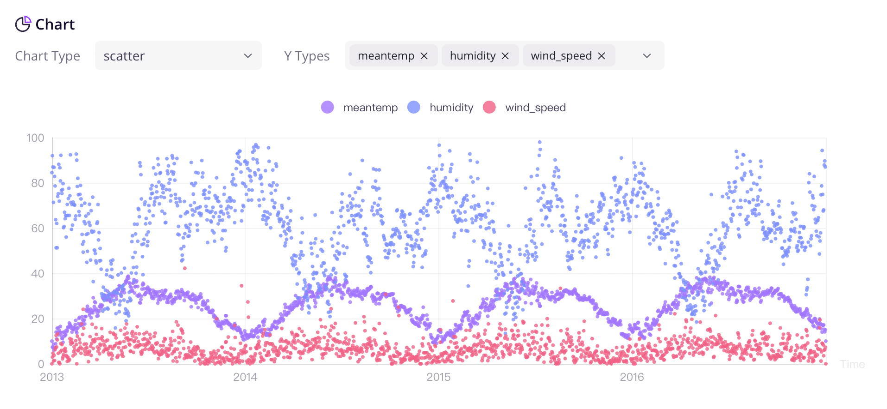

从这里开始探索 GreptimeDB 强大的核心功能。

## 安装 GreptimeDB

用户可以在[下载页面](https://greptime.com/download)通过我们发布的测试版本尝试使用 GreptimeDB。

我们先通过最简单的配置来开始。有关 GreptimeDB 中可用的所有配置选项的详细列表，请参考[配置文档](/user-guide/operations/configuration.md)。

### Linux & Mac

使用 Linux 和 macOS 的用户，可以通过以下命令下载 `greptime` binary 的最新版本：

```shell
curl -L https://raw.githubusercontent.com/GreptimeTeam/greptimedb/develop/scripts/install.sh | sh
```

下载完成后，binary 文件 `greptime` 将存储在用户当前的目录中。

用户可以在单机模式下运行 GreptimeDB：

```shell
./greptime standalone start
```

### Docker

请确保已经安装了 [Docker](https://www.docker.com/)。如果还没有安装，可以参考 Docker 官方的[文档](https://www.docker.com/getting-started/)进行安装。

```shell
docker run -p 4000-4004:4000-4004 \
-p 4242:4242 -v "$(pwd)/greptimedb:/tmp/greptimedb" \
--name greptime --rm \
greptime/greptimedb standalone start \
--http-addr 0.0.0.0:4000 \
--rpc-addr 0.0.0.0:4001 \
--mysql-addr 0.0.0.0:4002 \
--postgres-addr 0.0.0.0:4003 \
--prom-addr 0.0.0.0:4004 \
--opentsdb-addr 0.0.0.0:4242
```

数据将会存储在当前目录下的 `greptimedb/` 目录中。

如果用户想要使用另一个版本的 GreptimeDB 镜像，可以从我们的 [GreptimeDB Dockerhub](https://hub.docker.com/r/greptime/greptimedb) 下载。

**注意事项**:

如果正在使用小于 [v23.0](https://docs.docker.com/engine/release-notes/23.0/) 的 Docker 版本，由于旧版本的 Docker Engine 中存在 [bug](https://github.com/moby/moby/pull/42681)，所以当用户尝试运行上面的命令时，可能会遇到权限不足的问题。

用户可以:

1. 设置 `--security-opt seccomp=unconfined`：

   ```shell
   docker run --security-opt seccomp=unconfined -p 4000-4004:4000-4004 \
   -p 4242:4242 -v "$(pwd)/greptimedb:/tmp/greptimedb" \
   --name greptime --rm \
   greptime/greptimedb standalone start \
   --http-addr 0.0.0.0:4000 \
   --rpc-addr 0.0.0.0:4001 \
   --mysql-addr 0.0.0.0:4002 \
   --postgres-addr 0.0.0.0:4003 \
   --prom-addr 0.0.0.0:4004 \
   --opentsdb-addr 0.0.0.0:4242
   ```

2. 将 Docker 版本升级到 v23.0.0 或更高;

## 连接

GreptimeDB 支持[多种协议](/user-guide/clients.md)。这里使用 MySQL 客户端示例。

```sql
mysql -h 127.0.0.1 -P 4002
```

## 建表

**注意: GreptimeDB 提供了一种 schemaless 的数据写入方法，不用像使用其他协议那样手动创建表。详情请参见 [Automatic Schema Generation](/user-guide/write-data.md#automatic-schema-generation)。**

现在我们通过 MySQL 创建一个表。先创建 `system_metrics` 表，其中包含系统资源指标，包括 CPU /内存/磁盘的使用，这些数据每 5 秒就会被抓取一次。

```sql
CREATE TABLE IF NOT EXISTS system_metrics (
    host STRING,
    idc STRING,
    cpu_util DOUBLE,
    memory_util DOUBLE,
    disk_util DOUBLE,
    ts TIMESTAMP DEFAULT CURRENT_TIMESTAMP,
    PRIMARY KEY(host, idc),
    TIME INDEX(ts)
);
```

Field 描述:

| Field       | Type      | Description                            |
| :---------- | :-------- | :------------------------------------- |
| host        | string    | The hostname                           |
| idc         | string    | The idc name where the host belongs to |
| cpu_util    | double    | The percent use of CPU                 |
| memory_util | double    | The percent use of memory              |
| disk_util   | double    | The percent use of disks               |
| ts          | timestamp | Timestamp column incrementing          |

- 如果用户使用其他协议，该表可以自动创建。请参考 [Create Table](/user-guide/table-management#creat-table)。
- 关于创建表的 SQL 信息，请参考 [CREATE](/reference/sql/create.md)。
- 关于数据类型，请参考[数据类型](/reference/data-types.md)。

## 数据写入

使用 `INSERT` 语句是向表添加数据的一个简单方法。通过下面的语句，我们向 `system_metrics` 表插入了九条记录。

```sql
INSERT INTO system_metrics
VALUES
    ("host1", "idc_a", 11.8, 10.3, 10.3, 1667446797450),
    ("host1", "idc_a", 80.1, 70.3, 90.0, 1667446797550),
    ("host1", "idc_b", 50.0, 66.7, 40.6, 1667446797650),
    ("host1", "idc_b", 51.0, 66.5, 39.6, 1667446797750),
    ("host1", "idc_b", 52.0, 66.9, 70.6, 1667446797850),
    ("host1", "idc_b", 53.0, 63.0, 50.6, 1667446797950),
    ("host1", "idc_b", 78.0, 66.7, 20.6, 1667446798050),
    ("host1", "idc_b", 68.0, 63.9, 50.6, 1667446798150),
    ("host1", "idc_b", 90.0, 39.9, 60.6, 1667446798250);
```

关于 `INSERT` 语句的更多信息，请参考 [INSERT](/reference/sql/insert.md)。

## 数据查询

想要从 `system_metrics` 表中选择数据，可以使用 `SELECT` 语句：

```sql
SELECT * FROM system_metrics;
```

查询结果如下：

```
+-------+-------+----------+-------------+-----------+---------------------+
| host  | idc   | cpu_util | memory_util | disk_util | ts                  |
+-------+-------+----------+-------------+-----------+---------------------+
| host1 | idc_a |     11.8 |        10.3 |      10.3 | 2022-11-03 03:39:57 |
| host1 | idc_a |     80.1 |        70.3 |        90 | 2022-11-03 03:39:57 |
| host1 | idc_b |       50 |        66.7 |      40.6 | 2022-11-03 03:39:57 |
| host1 | idc_b |       51 |        66.5 |      39.6 | 2022-11-03 03:39:57 |
| host1 | idc_b |       52 |        66.9 |      70.6 | 2022-11-03 03:39:57 |
| host1 | idc_b |       53 |          63 |      50.6 | 2022-11-03 03:39:57 |
| host1 | idc_b |       78 |        66.7 |      20.6 | 2022-11-03 03:39:58 |
| host1 | idc_b |       68 |        63.9 |      50.6 | 2022-11-03 03:39:58 |
| host1 | idc_b |       90 |        39.9 |      60.6 | 2022-11-03 03:39:58 |
+-------+-------+----------+-------------+-----------+---------------------+
9 rows in set (0.00 sec)
```

用户可以使用 `count()` 函数获取表格中所有行的数量：

```sql
SELECT count(*) FROM system_metrics;
```

```
+-----------------+
| COUNT(UInt8(1)) |
+-----------------+
|               9 |
+-----------------+
```

`avg()` 函数返回特定字段的平均值：

```sql
SELECT avg(cpu_util) FROM system_metrics;
```

```
+------------------------------+
| AVG(system_metrics.cpu_util) |
+------------------------------+
|            59.32222222222222 |
+------------------------------+
```

使用 `GROUP BY` 子句，将具有相同数值的行分组为汇总行。

按 idc 分组的平均内存使用量：

```sql
SELECT idc, avg(memory_util) FROM system_metrics GROUP BY idc;
```

```
+-------+---------------------------------+
| idc   | AVG(system_metrics.memory_util) |
+-------+---------------------------------+
| idc_a |                            40.3 |
| idc_b |              61.942857142857136 |
+-------+---------------------------------+
2 rows in set (0.03 sec)
```

关于 `SELECT` 语句的更多信息，请查看 [SELECT](/reference/sql/select.md) 文件。

## Visualize data

可视化在有效利用时间序列数据方面发挥着关键作用。为了帮助用户充分利用 GreptimeDB 的各种功能，Greptime 提供了一个简单的 [dashboard](https://github.com/GreptimeTeam/dashboard)。

Dashboard 自 GreptimeDB v0.2.0 版本以来已经嵌入到 GreptimeDB 的 binary 文件中。在[启动 GreptimeDB ](https://dev.greptime-docs.pages.dev/zh/getting-started/overview#install-greptimedb)后，可以通过 HTTP 端点 `http://localhost:4000/dashboard` 访问 dashboard。当前版本的 dashboard 支持 MySQL 和 Python 查询，不久将支持 PromQL。

将 SQL 写入命令文本，然后单击 `RUN ALL`，我们将获取 system_metrics 中的所有数据。

```
SELECT * FROM system_metrics;
```



我们提供不同种类的图表，可以根据不同的场景进行选择。当用户有足够的数据时，图表的内容将更加丰富。




我们将持续开发和迭代这个开源项目，并计划将时间序列数据应用于监测、分析和其他相关领域的扩展。

## Next steps

至此我们展示了 GreptimeDB 的基本功能，更多的用户指南请查阅以下文档。

- [概念](../user-guide/concepts/overview.md)
- [客户端](../user-guide/clients.md)
- [管理表](../user-guide/table-management.md)
- [数据写入](../user-guide/write-data.md)
- [数据查询](../user-guide/query-data.md)
- [脚本-&-函数](../user-guide/scripts-&-functions/overview.md)
- [Prometheus](../user-guide/prometheus.md)
- [集群](../user-guide/cluster.md)
- [运维操作](../user-guide/operations/overview.md)
