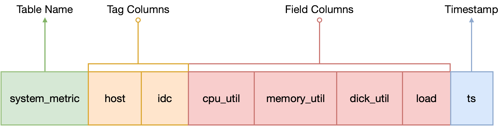

# 数据模型

GreptimeDB 使用时序表来进行数据的组织、压缩和过期管理。数据模型主要基于关系型数据库中的表模型，同时考虑到了时序数据的特点。

例如，我们有一个时序表 `system_metrics`，用于监测独立设备的资源使用情况：

```sql
DESC TABLE system_metrics;
```

```sql
+-------------+----------------------+------+---------------------+---------------+
| Field       | Type                 | Null | Default             | Semantic Type |
+-------------+----------------------+------+---------------------+---------------+
| host        | String               | NO   |                     | PRIMARY KEY   |
| idc         | String               | YES  | idc0                | PRIMARY KEY   |
| cpu_util    | Float64              | YES  |                     | FIELD         |
| memory_util | Float64              | YES  |                     | FIELD         |
| disk_util   | Float64              | YES  |                     | FIELD         |
| load        | Float64              | YES  |                     | FIELD         |
| ts          | TimestampMillisecond | NO   | current_timestamp() | TIME INDEX    |
+-------------+----------------------+------+---------------------+---------------+
7 rows in set (0.02 sec)
```

`host` 是收集的单机的主机名。`idc` 列显示机器所在的数据中心，`cpu_util`、`memory_util`、`disk_util` 和 `load` 是收集的单机指标，`ts` 是收集时间（Unix 时间戳）。

这些与大家熟悉的表模型非常相似。区别在于 `TIME INDEX(ts)` 约束，它用于指定 `ts` 列作为该表的时间索引列。

我们称这种表为 TimeSeries Table，它由四个部分组成：

- 表名：通常与指标名称相同，如这里的 `system_metric`。
- 时间索引列：必须有的内容，通常用来表示这一行的数据生成时间。例子中的 `ts` 列就是时间索引列。
- 度量列：收集的数据指标，一般随时间变化，如例子中的四个数字列（`cpu_util` 和 `memory_util` 等）。这些指标一般是数值，但也可能是其他类型的数据，如字符串、地理位置等。GreptimeDB 采用的是多值模型（一行数据可以有多个指标列），而不是 OpenTSDB 和 Prometheus 采用的单值模型。
- 标签列：附加在所收集的指标上的标签，如例子中的 `host` 和 `idc` 列，一般用来描述这些指标的某个特定特征。



GreptimeDB 是在 Table 之上设计的，原因如下：

- Table 模型有广泛的用户群，而且很容易学习，我们只是在时间序列中引入了时间索引的概念。
- Schema 是描述数据特征的元数据，对用户来说，管理和维护更加方便。通过引入 Schema 版本的概念，我们可以更好地管理数据的兼容性。
- Schema 通过其信息比如类型、长度为优化存储和计算带来了巨大的好处，我们可以在此基础上进行针对性的优化。
- 当我们有了 Table 模型后，我们很自然地引入 SQL，用它来处理各种索引表之间的关联分析和聚合查询，抵消了用户的学习和使用成本。

尽管如此，我们对 Schema 的定义并不是强制性的，而是更倾向于像 MongoDB 那样的 Schemaless 方式。更多细节见 [自动生成表结构](../write-data/overview.md#自动生成表结构)。
