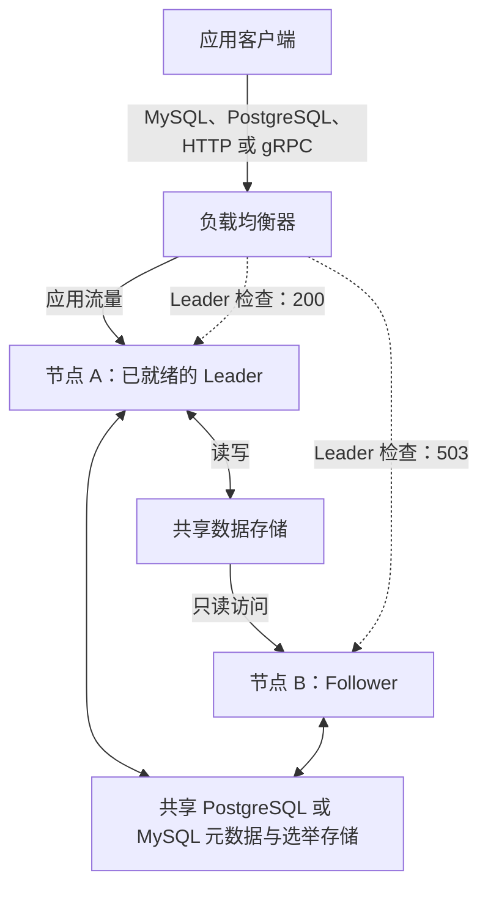

# Standalone Leader-Follower 模式

GreptimeDB 企业版支持以 Leader-Follower 模式部署 Standalone 节点，分别担任 Leader（主节点）和 Follower（备节点）。两个节点共享外部元数据存储和数据存储。其中一个节点通过选举成为 Leader，接受写入；另一个节点以 Follower 身份保持运行，并可在故障切换后成为 Leader。对于允许读取旧数据的负载，也可以启用 Follower 读取。

该拓扑与[双活互备](/enterprise/deployments-administration/disaster-recovery/dr-solution-based-on-active-active-failover.md)不同：双活互备中的两个 Standalone 节点都接受写入，并相互复制变更。它也不同于[集群读副本](/enterprise/read-replicas/overview.md)，后者在不同 Datanode 上管理 Follower Region。

## 选择部署模式

下表对比 Standalone Leader-Follower 模式、[双活互备](/enterprise/deployments-administration/disaster-recovery/dr-solution-based-on-active-active-failover.md)和[分布式集群](/user-guide/concepts/architecture.md)，帮助选择适合业务的部署方式。

| 对比项 | Standalone Leader-Follower 模式 | 双活互备 | 分布式集群 |
| --- | --- | --- | --- |
| 写入与查询 | 由选出的一个 Leader 接受写入。可选的 Follower 读取可能返回旧数据。 | 两个节点都接受写入，并在本地执行查询；变更异步复制到对端。 | Frontend 将写入路由到 Region Leader，并将查询分发到不同 Datanode。 |
| 状态与依赖 | 共享 PostgreSQL 或 MySQL 元数据存储和数据存储；负载均衡器将流量发送到 Leader。下文示例中每个节点使用各自的本地 WAL。 | 每个节点保存自己的完整数据副本和待复制变更，由外部机制路由流量。 | 分别部署 Frontend、Metasrv 和 Datanode 服务，以及元数据后端、数据存储和所选的 WAL 后端。 |
| 故障切换 | Follower 通过选举升主；新 Leader 就绪后，负载均衡器将新连接转发到该节点。 | 外部流量切换机制将请求转发到可用节点；该拓扑不会选举主节点。 | 配置 Region Failover 后，可在存活的 Datanode 上重新打开 Region。可用性取决于 WAL、共享存储和预留容量。 |
| 优点 | 支持自动升主，需要独立部署的 GreptimeDB 组件比分布式集群少。 | 节点间连接中断时，两端仍可独立提供服务，并在恢复后继续同步。 | 支持水平扩展、分布式查询，以及各服务组件的独立扩容。 |
| 限制 | 写入能力仍受单个 Leader 限制。两个节点都依赖共享服务；使用本地 WAL 时，节点及其 WAL 丢失可能导致尚未刷盘的写入丢失。 | 复制延迟可能导致对端缺少近期写入。需要规划独立写入和 Schema 变更的协调处理；该模式不提供分布式查询扩展能力。 | 需要部署和运维更多组件。故障切换和持久性依赖合理配置，并非使用集群模式就能自动获得。 |

如果单个 Standalone 节点足以承载写入负载，希望在不分别部署集群组件的情况下实现自动升主，并且能够提供高可用的共享元数据和数据存储，可以优先选择 Leader-Follower 模式。应用需要能够在故障切换后重新连接，并接受所选 WAL 配置的持久性限制。

如果需要两个节点独立接受写入，并在节点间连接中断时继续服务，可以优先选择双活互备。如果需要将写入或查询工作分散到多个 Datanode，应选择分布式集群。Leader 选举只负责确定可写节点，流量切换和重新连接仍由负载均衡器和客户端完成。

## 系统架构

在 Standalone 节点前部署负载均衡器，为应用提供稳定的访问端点。负载均衡器必须检查每个节点的 `/status/standalone/is_leader` HTTP 端点，并仅将应用流量发送到返回 `200 OK` 的节点。Follower 和正在准备成为可服务 Leader 的节点返回 `503 Service Unavailable`，不应通过该应用端点接收流量。



图中节点 A 是当前的 Leader。当节点 B 成为已就绪的 Leader 后，负载均衡器必须将新连接发送到节点 B，并停止向节点 A 发送新连接。为应用使用的协议分别配置监听器，并通过 HTTP Leader 检查为每个监听器选择可用的后端节点。不要仅根据进程健康状态在两个节点之间轮询转发请求。

如果启用了 Follower 读取，应为允许读取旧数据的负载配置独立的只读路由。主要应用端点应始终指向已就绪的 Leader。

## 工作原理

启用选举后，每个节点都以 Follower 身份启动服务，并通过共享的 PostgreSQL 或 MySQL 元数据存储参与 Leader 选举。当选节点会先准备本地 Region 和相关服务，再接受写入。

| 角色 | 行为 |
| --- | --- |
| `follower` | 拒绝写入和 Schema 变更。启用 Follower 读取后，可以刷新本地只读 Region。 |
| `leader_preparing` | 已赢得选举，但仍在准备对外服务。拒绝外部写入。 |
| `leader` | 已就绪，可以处理读取、写入和 Schema 变更。 |

角色由选举决定，因此任一节点都可能成为 Leader。负载均衡器根据角色变化将新连接发送到已就绪的 Leader；如果已有连接仍指向原 Leader，客户端必须重新连接。

## 前置条件

在两台独立主机上部署时，需要准备：

- 支持 Standalone Leader-Follower 模式以及所选 PostgreSQL 或 MySQL 元数据后端的 GreptimeDB 企业版构建。
- 部署在两个节点前的负载均衡器，并配置为根据 HTTP Leader 检查结果路由应用流量。
- 用于元数据和选举的共享 PostgreSQL 或 MySQL 数据库。本地 `raft_engine` **元数据后端**不支持选举。
- 两个节点均可访问的共享数据存储，例如相同的 S3 bucket 和 root 前缀。仅在各节点上使用独立的本地数据目录，无法提供共享的数据副本。
- 每个节点唯一且可访问的 gRPC 地址。启用 Follower 读取后，Follower 会通过 Leader 公布的地址检查数据更新。
- 每个节点各自的本地 WAL、日志和缓存目录，以及企业版部署所需的认证和许可证配置。

两个节点都依赖共享元数据数据库和数据存储。规划 Standalone 节点的可用性时，也需要考虑这些共享服务的可用性。

## 配置节点

以下示例用于新建的双主机部署，在节点 A 上配置 PostgreSQL 元数据存储和 S3 数据存储。请根据实际环境替换地址、凭据、bucket 和路径。其他存储配置请参考[存储选项](/user-guide/deployments-administration/configuration.md#storage-options)。

```toml title="standalone.toml"
[http]
addr = "0.0.0.0:4000"

[grpc]
bind_addr = "0.0.0.0:4001"
server_addr = "10.0.0.1:4001"

[wal]
provider = "raft_engine"
dir = "/var/lib/greptimedb/wal"

[storage]
data_home = "/var/lib/greptimedb"
type = "S3"
bucket = "<shared-bucket>"
root = "standalone-ha"
region = "<aws-region>"
access_key_id = "<access-key-id>"
secret_access_key = "<secret-access-key>"

[enterprise_standalone.metadata_store]
backend = "postgres"
store_addrs = ["postgres://<user>:<password>@<metadata-host>:5432/greptime_meta"]
table_name = "greptime_metakv"

[enterprise_standalone.metadata_store.election]
enabled = true
server_addr = "10.0.0.1:4001"
store_key_prefix = "standalone-ha"
meta_election_lock_id = 1
# 可选：节点作为 Follower 运行时，刷新只读 Region。
enable_follower_read = true
```

在节点 B 上使用相同的元数据数据库、元数据表、选举前缀、PostgreSQL 选举锁 ID，以及 S3 bucket 和 root。将两处 `server_addr` 都改为节点 B 可访问的 gRPC 地址，例如 `10.0.0.2:4001`。不同主机上的本地目录路径可以相同，但每个节点必须使用各自的本地 WAL 目录。

如需使用 MySQL 元数据存储，将 `backend` 设为 `"mysql"`，并在 `store_addrs` 中使用 MySQL 连接 URL。选举表名默认为 `<table_name>_election`；如果在选举配置中设置 `mysql_election_table_name`，两个节点必须使用相同的值。`meta_election_lock_id` 仅适用于 PostgreSQL。

使用各节点的配置文件启动服务，并按部署要求添加认证和许可证选项：

```shell
greptime-ee standalone start -c standalone.toml
```

### 选举选项

以下选项位于 `[enterprise_standalone.metadata_store.election]` 中：

| 选项 | 默认值 | 用途 |
| --- | --- | --- |
| `enabled` | `false` | 启用 Leader 选举。两个节点都应设为 `true`。 |
| `enable_follower_read` | `false` | 启用 Follower 的定期 Region 发现和读取刷新。需要同时启用选举。 |
| `server_addr` | 从 Standalone 对外公布的 gRPC 地址推导 | 标识当前选举参与者，并公布用于 Leader RPC 的地址。每个节点都应使用唯一且可访问的地址。 |
| `store_key_prefix` | 空字符串 | 选举记录的命名空间前缀。同一部署中的节点应使用相同的前缀。 |
| `meta_election_lock_id` | `1` | PostgreSQL 选举锁 ID。同一部署中的节点应使用相同的 ID。 |
| `candidate_lease_secs` | `600` | 候选者注册租约时长，单位为秒，必须大于零。 |
| `meta_lease_secs` | `5` | Leader 租约时长，单位为秒；同时控制 Follower 元数据轮询间隔，必须大于零。 |
| `mysql_election_table_name` | `<table_name>_election` | MySQL 选举表名。 |

## Follower 读取与数据新鲜度

Follower 读取刷新需要显式启用。当 `enable_follower_read = false` 时，Follower 仍会参与选举、拒绝写入，并可升为 Leader，但不会为查询流量定期发现 Region 或追平数据。

当 `enable_follower_read = true` 时，Follower 会从共享元数据中发现新增、变更或已删除的 Region，并更新本地只读 Region。应用可以直接向该 Follower 的 SQL 或 HTTP 端点发送查询。写入和 Schema 变更仍必须发送到 Leader。

Follower 查询读取的是已发布到共享存储的数据，**不会**获取 Leader 中尚未刷盘的 memtable 数据。需要写后立即读到最新数据的负载应查询 Leader。

元数据轮询间隔由 `meta_lease_secs` 控制，默认为 5 秒。已有 Region 的数据更新检查采用独立的 30 秒追平周期。数据何时可见还取决于 Leader 刷盘、存储访问和刷新完成时间，因此这些间隔并不代表数据延迟的上限。如果 Leader 不可用或尚未就绪，Follower 会保留当前本地 Region，并在后续刷新时重试追平。

可以在 Leader 上执行以下 SQL 进行简单验证：

```sql
CREATE TABLE follower_demo (
    ts TIMESTAMP TIME INDEX,
    value DOUBLE
);
INSERT INTO follower_demo VALUES ('2026-01-01 00:00:00', 1.0);
ADMIN FLUSH_TABLE('follower_demo');
```

随后查询 Follower，并为元数据发现和数据刷新预留时间：

```sql
SELECT * FROM follower_demo;
```

此处显式执行 flush 是为了将测试数据发布到共享存储，并不会使 Follower 读取变为同步读取。

## 检查角色与路由流量

通过节点的 HTTP 端点检查其角色：

```shell
curl http://10.0.0.2:4000/status/standalone/role
```

Follower 的响应示例：

```json
{
  "role": "follower",
  "is_leader": false,
  "leader_addr": "10.0.0.1:4001"
}
```

`leader_addr` 是 Leader 对外公布的 gRPC 地址；如果 Follower 尚不知道 Leader 地址，则返回 `null`。处于 `leader_preparing` 状态的节点也会返回 `is_leader: false`。

负载均衡器应使用以下端点检查节点是否可以接受写入：

```shell
curl -i http://10.0.0.1:4000/status/standalone/is_leader
```

- `200 OK`：节点是已就绪的 Leader。
- `503 Service Unavailable`：节点是 Follower，或仍在为成为可服务的 Leader 做准备。

通用的 `/health` 端点检查的是进程健康状态，不能证明节点可以接受写入。应使用 Leader 检查结果配置写入路由。如果启用了 Follower 查询，应单独路由这些查询，并允许返回旧数据。

:::warning Leader 退位后的持久连接

MySQL 持久连接或 gRPC channel 可能在原 Leader 退位后仍与其保持连接。连接虽然可能仍处于打开状态，但节点已成为 Follower，会拒绝后续写入。

更新负载均衡器的后端选择不会将已有连接迁移到新的 Leader。客户端和连接池必须处理写入被拒绝的情况，关闭或替换指向原 Leader 的连接，并在负载均衡器识别出新的已就绪 Leader 后，通过负载均衡器重新连接。在同一连接上重试写入可能持续失败。

:::

## 故障切换与持久性

Leader 失去领导权或停止运行后，Follower 可以赢得选举。它会使本地状态与共享元数据保持一致，并准备相关服务，完成后才将角色报告为 `leader`，并在 Leader 检查中返回 `200`。随后，负载均衡器会将新连接发送到该节点。客户端必须通过负载均衡器重新连接；选举不会迁移已有的客户端连接。

故障切换时间包括选举、Leader 准备、流量健康检查和客户端重连。仅凭租约时长无法保证 RTO。

上述示例中，每个节点使用各自的本地 WAL。Follower 不会复制另一个节点的本地 WAL 或尚未刷盘的 memtable。仅存在于原 Leader 本地 WAL 中的写入，在恢复并发布到共享存储之前，对新 Leader 不可用；如果发布前该 WAL 丢失，这些写入也可能丢失。因此，该配置不保证零 RPO。规划持久性要求时，请参考 [WAL 概述](/user-guide/deployments-administration/wal/overview.md)。

接入应用流量前，应确认只有一个节点通过 Leader 检查、Follower 拒绝写入，以及启用 Follower 读取后查询能够正常执行。随后停止 Leader，等待另一个节点通过 Leader 检查，再通过应用的常规访问端点验证读写。
