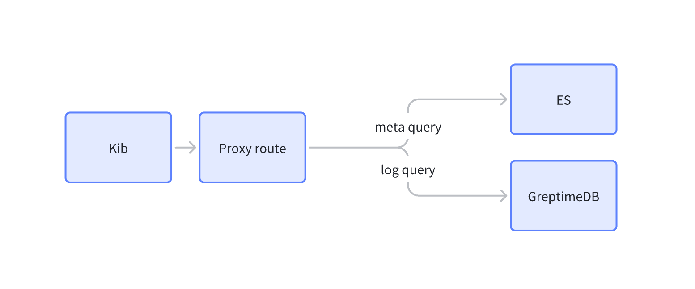

# 概述

GreptimeDB 的 Elasticsearch 兼容层旨在提供与 Elasticsearch 的在一定程度上的兼容性，以便用户能够相对轻松地将现有的 Elasticsearch 应用程序迁移到 GreptimeDB。

但是，GreptimeDB 并不完全兼容 Elasticsearch 的所有功能和特性。在某些情况下，用户可能需要对其应用程序进行调整和修改，以便在 GreptimeDB 中实现相同的功能。

## 原理

本质上 GreptimeDB 是接收 Elasticsearch 的 QueryDSL 语法，并将其转换为 GreptimeDB 的查询语法，并且按照 Elasticsearch API 格式来返回数据。从而实现与 Elasticsearch 的兼容性。

## API 支持列表

| API                            | Method | Description  |
| ------------------------------ | ------ | ------------ |
| /{table_name}/\_search         | POST   | 执行搜索查询 |
| /{table_name}/\_async_search   | POST   | 执行搜索查询 |
| /\_resolve/index/{schema_name} | POST   | 索引文档     |
| /{table_name}/\_field_caps     | GET    | 获取字段信息 |

## 查询支持列表

| Query        | Description  |
| ------------ | ------------ |
| match        | 匹配查询     |
| match_phrase | 短语匹配     |
| match_all    | 匹配所有     |
| term         | 精确匹配     |
| prefix       | 前缀匹配     |
| range        | 范围查询     |
| exists       | 字段存在查询 |
| bool         | 复合查询     |
| aggregation  | 聚合查询     |

## 聚合支持列表

| Aggregation    | 实现情况 | Description |
| -------------- | -------- | ----------- |
| avg            |          | 平均值      |
| sum            |          | 求和        |
| min            |          | 最小值      |
| max            |          | 最大值      |
| count          | ✅       | 计数        |
| date_histogram | ✅       | 日期直方图  |
| histogram      |          | 直方图      |
| terms          |          | 词条聚合    |

## 使用 Kibana 查询 GreptimeDB

如图所示，我们使用一个 proxy 来区分元信息请求和真正的数据查询请求，从而实现对 GreptimeDB 的查询。

如需了解更多信息，请联系我们。
