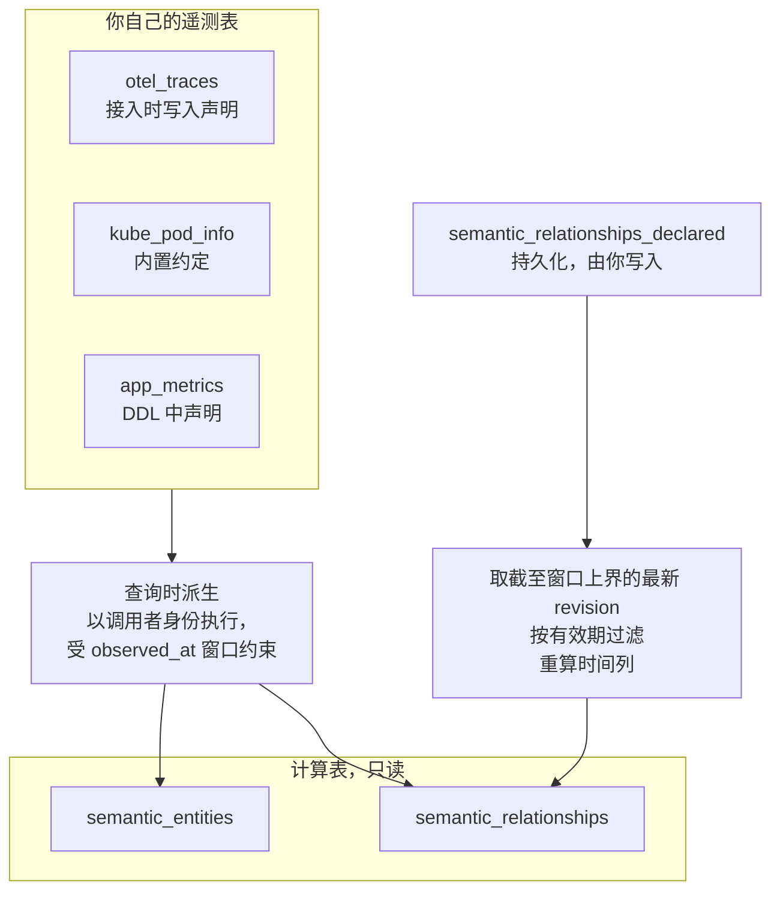

# 语义层

:::warning
语义层目前处于实验阶段，未来版本可能发生变化。未配置语义元数据的表行为不变；语义层是可选功能。
:::

语义层描述 GreptimeDB 所存数据的可观测性含义，让 LLM agent、告警与仪表盘生成器、[MCP server](/user-guide/integrations/mcp.md) 和 ETL 流水线等下游工具不必从列名推断。它由两部分组成：

- **表语义**记录单张表代表什么：遥测信号类型、接入来源，以及 metric 单位、instrument 类型等信号特定的元数据。
- **语义图**记录遥测数据描述的对象：行所描述的实体（service、host、pod、container、AI agent）以及它们之间的关系（哪个 service 调用哪个、哪个 pod 运行在哪个节点上）。

选项词汇表、两张表的 schema 和查询写法在[语义层用户指南](/user-guide/semantic-layer/overview.md)。

## 为什么需要它

GreptimeDB 接收 OTLP metrics、traces、logs，以及 Prometheus remote write、InfluxDB Line Protocol、OpenTSDB、Loki Push API 和 Elasticsearch Bulk API 数据。有两类信息随数据一同到达，但都不会写进数据行。

第一类是接入协议携带、而行编码器丢弃的单表元数据：

- 一张 OTLP traces 表看起来和任何宽表没区别；signal type 和 source 只能从命名推断。
- OTLP metric 的单位（`s`、`By`）被行编码器丢弃，从数据里无法还原。
- OTLP 的聚合 temporality（`cumulative` vs `delta`）不体现在 metric 名字中。
- Prometheus 中根据 `_total` 后缀推断出的 `counter` 不是协议声明。没有语义元数据时，表中不会记录这个区别。

第二类是跨表的结构。一个 service 的延迟指标、它的 span、它的日志分别落在不同的表里，"它们描述同一个 service"、"这个 service 调用了另一个 service"这类事实，只以列值约定的形式存在。要拿到"这个实体、它的邻居以及它们的遥测数据"，只能硬编码拓扑，或者从列名推断。

两类信息都保留下来之后，告警生成器能区分速率和绝对值，仪表盘生成器能按 signal type 选择展示方式，agent 能在同一个查询引擎内从告警的 service 找到它的依赖，再取这些依赖的遥测数据。

## 工作原理

两部分都使用现有的 SQL 接口，不增加协议或 DDL 关键字。

1. **`greptime.semantic.*` 表选项**与 `ttl`、`table_data_model` 等选项一起保存表身份、写入元数据和实体身份。支持的接入路径会自动写入，你也可以用 `CREATE TABLE ... WITH (...)` 或 `ALTER TABLE ... SET` 设置。
2. **[`information_schema.table_semantics`](/reference/sql/information-schema/table-semantics.md)** 是这些选项、以及由它们解析出的实体声明的查询入口。
3. **`greptime_private.semantic_entities` 和 `greptime_private.semantic_relationships`** 以两张只读表的形式暴露语义图。

## 实体与关系

**实体**是遥测数据所描述的对象：service、service instance、host、container、Kubernetes 的 pod、node、workload、service，以及 AI agent、model、tool。一张表声明它的行描述了哪些实体，以及哪些列标识每个实体。两张表只要标识值相同，描述的就是同一个实体：一个 service 从 trace 和从 metric 进入图后仍是同一个节点。

**关系**是两个实体之间带类型、有方向、在某个时间窗口内成立的边：`calls`、`runs_on`、`contains`、`part_of`、`depends_on`、`uses`、`invokes`。每条边都带一个 `provenance`，记录它的来源方式——由配对的 trace span 派生、由同一行上的两个身份派生，还是人工声明——以及一个 `confidence`。调用边还带有所在窗口的 RED 指标（请求数、错误数、耗时）。

边是有时间范围的事实，不是当前状态。派生边覆盖一个 60 秒窗口，因此"当前拓扑"是对最近若干窗口的查询；实体或边一旦不再产生遥测数据就不再出现，不需要额外的过期机制。人工声明的边覆盖的则是你给定的有效期，保留到你删除它，或该行随 TTL 过期。

## 读时派生

语义图的两张表是计算出来的，不是存储的。扫描它们时，会枚举实体声明、为每张声明表构建查询计划，并在已有的遥测数据上执行。只有人工声明的边是持久化的，存放在 `greptime_private.semantic_relationships_declared`。

这是因为 GreptimeDB 用同一个引擎存储 metrics、logs 和 traces：服务调用图是 trace 表的自连接，把实体和它的遥测数据关联起来是同库内的 join，两者都不需要第二份存储。

由此带来三个结果：

- 实体在第一行数据落库的那一刻就出现。写入时不需要额外建索引，没有物化延迟，也不存在需要与源数据保持同步的副本。
- 派生以发起查询的用户身份执行。调用者读不到的源表会被排除在结果之外；查询语义图不会扩大调用者的可见范围。
- 每次扫描都会对源表做实际计算，计算量由查询的时间窗口决定。完全不带 `observed_at` 谓词时取最近一小时；带了谓词但取不到下界的查询会被拒绝，而不是扫描全部历史。

## 对 agent 的影响

[Agent RCA Bench](https://rca-bench.greptime.com/#zh) 把语义层作为独立的一组接口来测量，底层与仅使用 SQL 和 PromQL 的一组基于相同的 GreptimeDB 表。

效果最明确的是定向检索证据。在固定队列的 micro benchmark 中，全部 35 组符合条件的 Discovery 结果里，语义接口读回的行数都更少——Discovery 要求模型先找到承载证据的表和信号；在 12 组依赖检索结果中，有 11 组同时减少了读回行数和工具调用次数。

在服务与依赖类故障上，它也是三种接口中准确率最高的：带语义层 120 次中 112 次正确，同样的表不带语义层是 120 次中 106 次，Prometheus、Loki、Tempo 三个独立后端是 120 次中 85 次。启用语义层后没有模型的准确率下降，6 个模型中有 4 个上升。

端到端排查上，14 个 case 的样本量不足以区分两组 GreptimeDB 接口。[完整报告](https://github.com/GreptimeTeam/agent-rca-bench/blob/main/REPORT.md)公开了测量协议和逐次运行数据。

## 限制

- `calls` 边上的 RED 指标描述的是实际观测到的 span 配对。在 trace 采样下，计数会低于真实流量；只有当采样与状态、耗时无关时，错误率才有代表性。
- 图的连通程度取决于各张表共享的标识值。两张表用不同的值指代同一个 service，就会得到两个节点。设置了 `service.namespace` 时，默认配置下就会出现这种情况：trace 给出的是服务名本身，Prometheus 风格的描述性指标给出的是 `<namespace>/<name>`。
- `semantic_entities` 每个窗口、每张贡献表返回一行。查询时用 `SELECT DISTINCT entity_type, entity_id` 去重。
- 在非常大的 trace 表上，读时派生每次扫描的开销都高于预先物化的拓扑。

## 下一步

- **[语义层用户指南](/user-guide/semantic-layer/overview.md)**——选项、两张表和查询写法。
- [声明实体与关系](/user-guide/semantic-layer/declaring-entities.md)——哪些数据无需配置即可进入图，其余的如何声明。
- [`information_schema.table_semantics`](/reference/sql/information-schema/table-semantics.md)、[`semantic_entities`](/reference/sql/greptime-private/semantic-entities.md)、[`semantic_relationships`](/reference/sql/greptime-private/semantic-relationships.md)——列定义参考。
