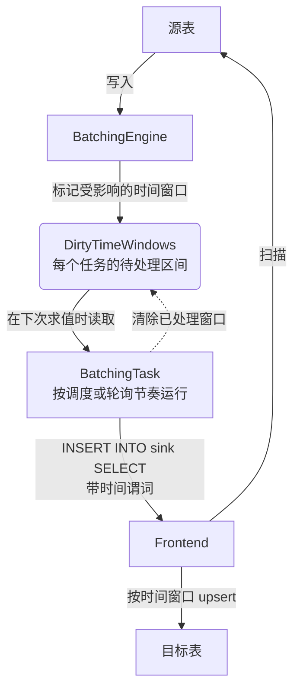

# 批处理模式

本指南简要概述了 `flownode` 中的批处理模式。它旨在帮助希望了解此模式内部工作原理的开发人员。

## 概述

`flownode` 中的批处理模式专为持续数据聚合而设计。它在离散的小时间窗口上周期性执行用户定义的 SQL 查询。旧 streaming 路径则在数据到达时进行处理，目前仅为兼容已有 workload 而保留，不推荐新 workload 使用。

其核心思想是：
1.  定义一个带有 SQL 查询的 `flow`，该查询将数据从源表聚合到目标表。
2.  查询通常在时间戳列上包含一个时间窗口函数（例如 `date_bin`）。
3.  当新数据插入源表时，系统会将相应的时间窗口标记为“脏”(dirty)。
4.  一个后台任务按自身的节奏运行，在下一次求值时取出待处理的脏窗口，并对这些时间范围重新运行聚合查询。
5.  然后将结果插入到目标表中，从而有效地更新聚合视图。

## 架构

批处理模式由几个协同工作的关键组件组成，以实现这种持续聚合。如下图所示：

### `BatchingEngine`

`BatchingEngine` 是批处理模式的核心。它是一个管理所有活动 flow 的中心组件。其主要职责是：

-   **任务管理**: 维护一个从 `FlowId` 到 `BatchingTask` 的映射。它处理这些任务的创建、删除和检索。
-   **事件分发**: 当新数据到达（通过 `handle_inserts_inner`）或当时间窗口被显式标记为脏（`handle_mark_dirty_time_window`）时，`BatchingEngine` 会识别受影响的 flow，并将信息转发给相应的 `BatchingTask`。

### `BatchingTask`

`BatchingTask` 代表一个独立的、单个的数据流。每个任务都与一个 `flow` 定义相关联，并在其自己的异步循环中运行。

-   **配置 (`TaskConfig`)**: 此结构体持有 flow 的不可变配置，例如 SQL 查询、源表和目标表名以及时间窗口表达式。
-   **状态 (`TaskState`)**: 包含任务的动态、可变状态，最重要的是 `DirtyTimeWindows`。
-   **执行循环**: 任务运行一个无限循环 (`start_executing_loop`)，该循环：
    1.  检查关闭信号。
    2.  睡眠到下一次求值时间。设置了求值调度的任务睡眠到下一个调度时间点；自适应任务则按时间窗口大小和最小刷新间隔计算出的轮询间隔睡眠。
    3.  基于当前的脏时间窗口集合生成一个新的查询计划 (`gen_insert_plan`)。
    4.  对数据库执行查询 (`execute_logical_plan`)。
    5.  清理已处理的脏窗口。

### `TaskState` 和 `DirtyTimeWindows`

-   **`TaskState`**: 此结构体跟踪 `BatchingTask` 的运行时状态，包括用于确定待处理工作的 `dirty_time_windows`。
-   **`DirtyTimeWindows`**: 此数据结构跟踪上次查询执行后接收到新数据的时间窗口，并保存一组不重叠的时间范围。执行循环根据它构造 `WHERE` 子句，只从源表选择脏窗口。

### `TimeWindowExpr`

`TimeWindowExpr` 是一个用于处理像 `date_bin` 这样的时间窗口表达式的辅助工具。

-   **求值**: 它可以接受一个时间戳并对时间窗口表达式求值，以确定该时间戳所属窗口的开始和结束。
-   **窗口大小**: 它还可以从表达式中确定时间窗口的大小（持续时间）。

标记脏窗口和生成源表过滤条件使用同一套计算。

## 查询执行流程

以下是批处理模式下查询执行的简化分步演练：

1.  **数据摄取**: 新数据被写入源表。
2.  **标记为脏**: `BatchingEngine` 收到有关新数据的通知。它使用与每个相关 flow 关联的 `TimeWindowExpr` 来确定哪些时间窗口受到新数据点的影响。然后将这些窗口添加到相应 `TaskState` 中的 `DirtyTimeWindows` 集合中。标记脏窗口不会唤醒任务。
3.  **下一次求值**: `BatchingTask` 的执行循环在调度时间点或自适应轮询间隔结束后进入下一次求值，取出待处理的脏窗口。
4.  **计划生成**: 任务调用 `gen_insert_plan`。此方法：
    -   检查 `DirtyTimeWindows`。
    -   生成一系列 `OR` 连接的 `WHERE` 子句（例如 `(ts >= 't1' AND ts < 't2') OR (ts >= 't3' AND ts < 't4') ...`），覆盖所有脏窗口。
    -   重写原始 SQL 查询以包含此新过滤器，确保只处理必要的数据。
5.  **执行**: 修改后的查询计划被发送到 `Frontend` 执行。数据库处理已过滤数据的聚合。
6.  **Upsert**: 结果被插入到目标表中。目标表通常定义了一个包含时间窗口列的主键，因此现有窗口的新结果将覆盖（upsert）旧结果。
7.  **状态更新**: `DirtyTimeWindows` 集合中刚刚处理过的窗口被清除。然后任务返回睡眠状态，直到下一个时间间隔。