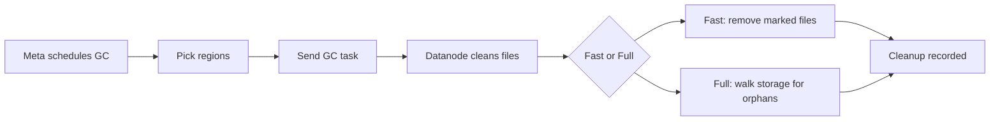

# 配置

GreptimeDB GC 会延迟删除 SST/索引文件，直到所有引用（运行中的查询、[repartition](../manage-data/table-sharding.md#Repartition) 的跨 region 文件引用）释放。配置包含两部分：

- Metasrv 配置
- Datanode 配置

## 工作原理

- **角色**：Meta 决定何时/何处清理；Datanode 负责实际删除，同时保护正在使用的文件。
- **安全窗口**：`lingering_time` 会额外保留已移除文件；`unknown_file_lingering_time` 用于极少见的保护场景。
- **列举模式**：快速模式删除系统已标记的文件；全量列举遍历对象存储以发现滞留/孤儿文件。



## Metasrv 配置

在 Metasrv 侧，GC 负责为各个 region 安排清理任务，并协调 GC 的运行时机。

```toml
[gc]
enable = true              # 开启 meta GC 调度器；必须与 datanode 一致。
gc_cooldown_period = "5m"   # 同一 region 再次 GC 的最小间隔。
```

### 配置

| 配置项 | 说明 |
| --- | --- |
| `enable` | 启用 meta GC 调度器，必须与 datanode 的 GC 开关一致。 |
| `gc_cooldown_period` | 同一 region 再次被调度 GC 的最小间隔；请保证 datanode 的 `lingering_time` 大于该值。 |

## Datanode 配置

Datanode 负责实际删除，同时保护仍在使用中的文件。

```toml
[[region_engine]]
[region_engine.mito]
[region_engine.mito.gc]
enable = true                   # 开启 datanode GC worker；必须与 meta 一致。
lingering_time = "10m"           # 已移除文件在活跃查询期间保留时长。
unknown_file_lingering_time = "1h" # 未记录 expel time 的文件保留时长；罕见保护。
```

### 配置

| 配置项 | 说明 |
| --- | --- |
| `enable` | 启用 datanode GC worker，必须与 meta GC 的 `enable` 一致。 |
| `lingering_time` | manifest 中已移除文件在删除前的保留时长，用于保护长时间 follower-region 查询/跨 region 引用；请设置为大于 `gc_cooldown_period`。设为 `"None"` 表示立即删除。 |
| `unknown_file_lingering_time` | 对缺少 expel time 的文件的安全保留时间（未在 manifest 中追踪）。建议设置为较长值；此类情况较少。 |

:::warning
`gc.enable` 必须在 metasrv 与所有 datanode 上保持一致。开关不一致会导致 GC 被跳过或卡住。
:::

## 何时启用

- GC 仅在表使用对象存储时生效；本地文件系统上的表会忽略 GC 设置。
- 如果需要重分区，请开启 GC，以便跨 region 引用在删除前安全释放。
- 对于有长时间 follower-region 查询的集群，开启 GC 并将 `lingering_time` 设为大于 `gc_cooldown_period`，确保 GC 周期内创建或引用的文件保持存活（在用或 lingering）直到至少下个周期。
- 如果不进行重分区且不需要延迟删除，可保持 GC 关闭。

## 运维注意事项

- GC 面向对象存储后端（需支持 list/delete）；确保存储凭据与权限允许列举和删除。
- 删除的文件会在对象存储中保留直到 GC 清理；确保具备列举/删除权限。
- 启用后重启 Metasrv 与 Datanode 以使配置生效。
